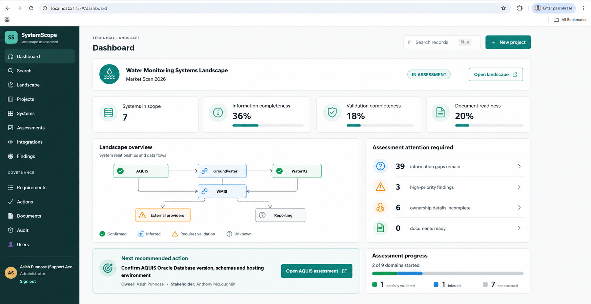
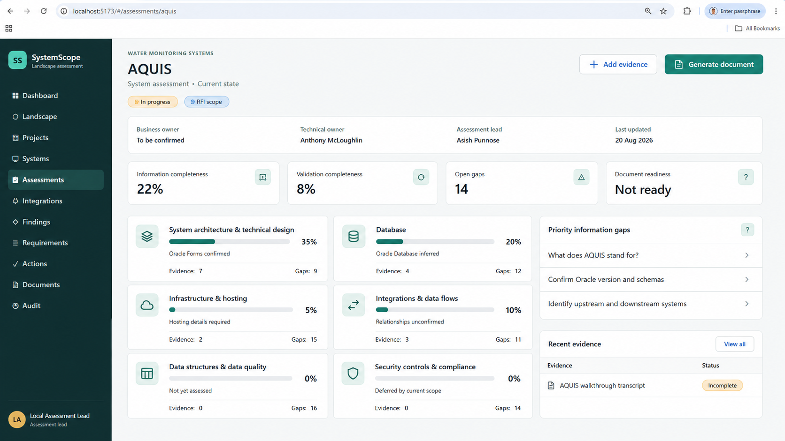
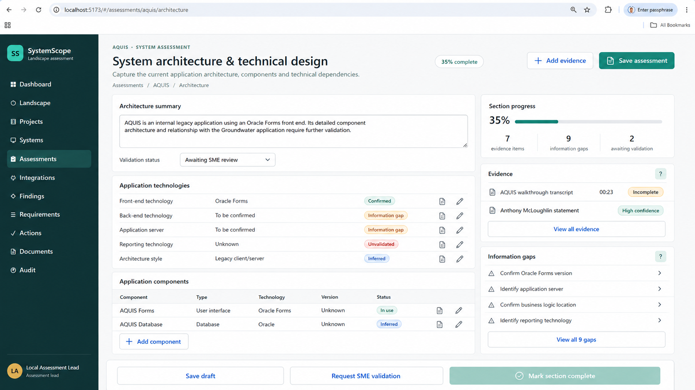
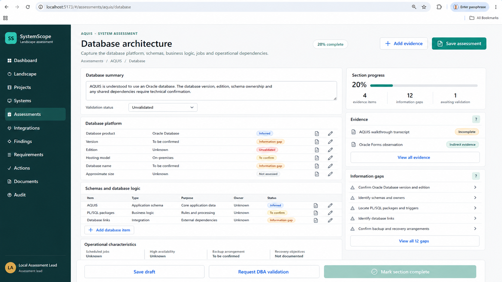
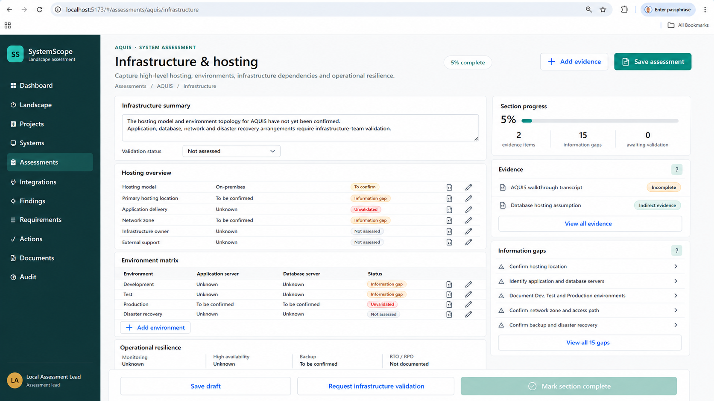

# SystemScope — Built Features

**Product:** SystemScope  
**Audience:** Assessment leads, analysts, SMEs, document approvers, and administrators  
**Date:** 27 August 2026  
**Status:** Working application as implemented in this repository (Phase 1 PRs 1–4 in tree)  

This document describes the features that have been built in SystemScope. It is a product-level catalogue of what the application does today, not a backlog.

---

## 1. What SystemScope is

SystemScope is a standalone technical landscape assessment application. It captures structured, evidence-backed information about an organisation's systems and uses that data to drive:

- a live assessment dashboard
- an interactive landscape map
- reusable system records
- structured business capabilities and information assets (catalogues, not free text)
- six-plus domain assessments
- findings, gaps, requirements and actions
- SME validation
- generated Word documents with approval and publication
- searchable published records

The immediate use case is the **Water Monitoring Systems Market Scan 2026**, starting with AQUIS and related groundwater, hydrometry and field applications. Documents are outputs. The assessment data is the source of truth.

### Design principles that the product enforces

1. **Capture once, reuse many times.** Structured facts feed dashboards, search, diagrams and documents.
2. **Evidence before assertion.** Important facts can be linked to a source.
3. **Claims are not automatically facts.** AI-extracted statements must be reviewed before they update an assessment.
4. **Unknown is not poor.** Missing information is recorded as a gap, not a negative finding, and does not unfairly reduce scores.
5. **Current state and future state stay separate.** Proposed capabilities are labelled and are not treated as existing functionality.
6. **Security-sensitive content is controlled.** Restricted security details are excluded from external documents unless an internal security appendix is selected.
7. **Documents are versioned outputs.** Generation creates an immutable snapshot with checksum and record ID.
8. **Material change is auditable.** Creates, reviews, approvals, downloads and exports record the actor and UTC timestamp.

---

## 2. Solution shape

| Layer | Implementation |
| --- | --- |
| Frontend | React 19 + TypeScript single-page application |
| Backend | ASP.NET Core API targeting .NET 10 |
| Packaging | Client production assets are built into the API `wwwroot` and published as one artifact |
| Hosting | One Azure Linux Web App serves the SPA at `/` and the API at `/api` |
| Database | Azure SQL with managed-identity authentication, or in-memory for local development |
| Identity | Microsoft Entra JWT bearer authentication when configured; local Assessment Lead identity otherwise |
| Infra | Bicep template plus `infra/Deploy-SystemScope.ps1` |
| Schema | Forward-only SQL migrations with `dbo.App_Schema_Migrations` journal |
| Health | Public `GET /health` for App Service health checks |

Local development uses an in-memory database that resets on restart and does not store secrets or production data. Azure deployments connect to Azure SQL with `Active Directory Default` so the Web App system-assigned managed identity authenticates without a stored database password.

---

## 3. Identity, access and security

### Sign-in

- Microsoft Entra ID (DLGWV SSO) is used when tenant and client IDs are configured.
- The SPA acquires a bearer token and sends it on every `/api` call.
- When Entra is not configured, a local **Assessment Lead / Administrator** identity is used so the product can be developed without secrets.

### Access gate

New organisational users cannot use the application until an administrator approves them.

- Sign in with Microsoft account.
- If the user has no approved record, they see an access-request screen.
- They can submit a request; the first user in an empty store is auto-approved as administrator.
- Subsequent users stay **Pending** until a security manager acts.
- Rejected and inactive users cannot enter the application.

### User administration (`#/users`)

Visible only to users with the `security.users.manage` permission or an Administrator / admin role.

- Tracked users, pending requests and approved users.
- Approve, reject or leave pending.
- Assign **admin** or **user** role.
- Activate or deactivate a record.
- Approving a user with no roles assigns `user` by default.
- Admins automatically receive the user-management permission.

### Server-side enforcement

- `/api` routes require authentication.
- The access gate middleware blocks unapproved users even if they hold a valid Entra token.
- Evidence URLs must be HTTPS and, when configured, must match approved repository hosts (for example SharePoint).
- Attachments, secrets, connection strings and production datasets are not accepted as evidence payloads.
- Requirement approval can enforce submitter/approver separation of duties.
- Approved documents lock; comments and re-submission are rejected on a locked file.
- Publication is rejected unless the document's approval state is **Approved**.

---

## 4. Navigation and personas

The application uses hash routing. The sidebar groups work as:

**Top**

- Dashboard
- Search
- Landscape
- Projects
- Systems
- Assessments
- Integrations
- Findings

**Governance**

- Requirements
- Actions
- Documents
- Audit
- Users (administrators only)

The header search control (`⌘ K` / `Ctrl+K`) opens the global search page.

Persona chrome changes by screen:

| Screen | Shown as |
| --- | --- |
| Assessment workspace | Signed-in assessment lead (or administrator) |
| SME validation portal | Anthony McLoughlin, subject-matter expert |
| Document approval | Michael, document approver |

The SME portal uses a reduced navigation: My validation requests, Completed, Help.

Desktop sidebar collapses to an off-canvas drawer on tablets and phones. Dashboard cards reflow from four columns to two then one. Registers that cannot reflow safely scroll horizontally. Controls use labels, status regions, dialog semantics and mobile-sized touch targets.

---

## 5. Dashboard

The dashboard is the live management view for a selected project or landscape.

### Project selector

A **Project or landscape** dropdown scopes every KPI, relationship map and attention item. The active project status is shown beside an **Open landscape** action.

### KPI tiles

| KPI | Meaning |
| --- | --- |
| Systems in scope | Assessed systems in the selected project |
| Information completeness | Weighted fill of required current-state attributes |
| Validation completeness | Share of filled facts and claims that are SME/technically validated |
| Document readiness | Whether required information, high-impact claims, critical gaps, conflicts and high findings are ready for generation |

Tiles open the assessments workspace.

### Assessment application relationships

A relationship diagram of in-scope applications and recorded system-to-system links. Nodes are clickable and open that system's assessment. Status colours:

- **Confirmed** — validated
- **Inferred** — captured but not yet validated
- **Requires validation** — awaiting SME or analyst
- **Unknown** — future-state or not recorded

If no applications are in scope, an empty state explains that.

### Assessment attention required

Clickable counts for:

- information gaps remaining
- high-priority findings
- ownership details incomplete
- documents ready

### Next recommended action

The highest-priority open action, or the most severe unapproved finding, with owner, due date and an **Open** shortcut into the relevant assessment.

### Assessment progress and evidence confidence

A stacked bar of domain progress (validated / inferred / unvalidated / not assessed) plus counts of confirmed, inferred, unvalidated and unknown evidence.

---

## 6. Interactive landscape

The landscape is the visual assessment workspace for the water management value chain (seeded as-is v5.0, April 2025). It is a pan/zoom canvas of systems, interfaces and assessment status.

### Live box status

Every system box shows live status derived from project registers:

- not in scope
- registered
- in workshop
- submitted
- approved
- High / Critical finding pins
- information gaps
- last-confirmed evidence

In-scope systems stay full strength. One-hop neighbours are marked as context / dependency.

### Coverage heat

Optional heat colours boxes green / amber / red from mandatory workshop answers or open High/Critical findings.

### Scope from the map

- Multi-select systems and add them to a project.
- Clusters (groundwater, monitoring, compliance, entitlements, public) can start a shared scope and open workshop.
- Batch system registration is available through the API.

### Connections

Connection lines are clickable. From an interface the user can create an integration, finding or action. Selecting a link shows direction, data exchanged, method, frequency, owners and monitoring.

### Layout and versions

- Drag boxes, add systems, draw links, and set regional / decommissioned flags.
- Dated as-is / to-be versions persist through `GET/POST /api/landscape`.
- As-is, to-be and compare layers show keep / retire / replace / consolidate / add.
- Capability swimlanes group entitlements, compliance, groundwater, monitoring, spatial, operations, public channels and corporate.

### Focus, blast radius and HSI

- **Focus mode** isolates one or more relationship hops around the selected system, with a breadcrumb back to the full landscape.
- **Blast-radius** lists downstream dependents.
- Search isolates and centres matching systems. Filters isolate rather than greying the estate. Fit includes every shown box.
- **HSI view** projects the same estate by hosting (on-prem, Azure, SaaS, field, external) and identity provider, with hosting / identity / UI-tech filters.

### System details panel

Overview, Technology, Data, Assessment and Records, including owners, UI/API/database, hosting and identity.

### Export

- PNG of the current view.
- Printable in-scope pack of systems, interfaces and findings.

Workshop Integration and Architecture questions also show the assessed system and its landscape neighbours.

---

## 7. Projects

Assessment work is organised as projects.

### Create a project

Required fields:

- name
- objective
- scope
- owner
- start date
- target date

Creation writes an append-only audit event.

### Project workspace

Selecting a project shows owner, target date, status and the systems in scope. From a system row the user can **Open assessment**. **Add system** registers a new system against the project and, if needed, creates or reuses a master system record so the same application is not duplicated across projects.

Batch add is available at `POST /api/projects/{id}/systems/batch`. An existing master system can be placed in scope with `POST /api/projects/{id}/scope`.

Material records carry archived-record metadata and optimistic-concurrency row versions.

---

## 8. Systems register and system profile

### Systems register (`#/systems`)

One reusable master record per system. A system can belong to multiple assessment projects.

The register shows:

- name, acronym and description
- lifecycle (Active, Legacy / Maintain, and others)
- technologies / tags
- information completeness, validation completeness and document readiness
- last updated

Capabilities:

- search across name, acronym, description, tags and technologies
- filter by lifecycle
- sort by name, progress or updated
- list or grid layout
- open the system profile or jump straight into the assessment

### System profile (`#/systems/{key}`)

Authoritative record for assessment, ownership, technology, relationships and published documentation.

Tabs:

| Tab | Content |
| --- | --- |
| Overview | Purpose, owners, classification, lifecycle, completeness KPIs, priority gaps, capability chips when coverage exists |
| Capabilities | Structured business capabilities linked to the master system (name, level, role, validation) |
| Technology | Front end, database, architecture style, application server, reporting — each with validation status |
| Integrations | Recorded relationships (confirmed, inferred, proposed, unconfirmed) |
| Data | Information assets (business data objects) above data-quality domains |
| Evidence | HTTPS sources and how many catalogue records they also link to |
| Findings | Observations, risks and gaps for this system |
| Documents | Published documents shown on the profile |
| History | Recent audit activity |

Actions from the profile: open assessment, add evidence, open documents, open a published record, navigate to a related system.

Enterprise catalogues (sidebar **CATALOGUE**):

- `#/capabilities` — L1–L3 business capability register. GWDB is seeded with Groundwater operations and five L2 capabilities (Bore Registration, Water Level Monitoring, Water Quality Monitoring, Pump Testing, Geological Logging).
- `#/information-assets` — business data assets independent of database tables. GWDB is system of record for Bore, Aquifer, Water Level and Water Quality Result. Classification is Public / Internal / Sensitive / Restricted and does not overwrite system `OFFICIAL`.

---

## 9. Assessments workspace

The market-scan assessment is the primary structured capture for a system. Seeded route: `#/assessments/aquis`.

### Overview

Header:

- system name and current-state label
- In progress (or other status)
- RFI scope pill when the system is included in the RFI
- **Add evidence**
- **Generate document**

Metadata: business owner, technical owner, assessment lead, last updated.

KPIs:

- information completeness
- validation completeness
- open Must-priority gaps
- document readiness (**Ready** at 80%+, otherwise **Not ready**)

Domain cards (completeness bar, evidence count, gap count, short status) open that domain. Priority information gaps and recent evidence sit below the cards.

### Assessment domains

Eight domains are modelled. The original market-scan six are first-class screens; Operations and Limitations extend the same pattern.

| Domain | Weight | Route | Required attributes (examples) |
| --- | --- | --- | --- |
| System architecture & technical design | 20 | `#/assessments/{key}/architecture` | Front-end, back-end, application server, reporting, architecture style |
| Database | 15 | `#/assessments/{key}/database` | Product, version, edition, hosting location, instance, size |
| Infrastructure & hosting | 10 | `#/assessments/{key}/infrastructure` | Hosting model/location, delivery, network zones, owner, support |
| Integrations | 15 | `#/assessments/{key}/integrations` | Inbound/outbound systems, interface types, current-state catalogue |
| Data flows | — (same domain) | `#/assessments/{key}/data-flows` | Data sets, source/destination, batches |
| Data structures & data quality | 10 | `#/assessments/{key}/data-quality` | Domains, entities, classification, retention, quality ratings |
| Security controls & compliance | 10 | `#/assessments/{key}/security` | Auth, SSO, MFA, RBAC, encryption, audit, obligations |
| Operations | 10 | `#/assessments/{key}` operations tab | Release, support model/hours, patching, monitoring, escalation |
| Limitations | 10 | limitations tab | Known limitations, technical debt, vendor support, key-person, legacy |

### What each domain screen does

- Domain summary and validation status.
- Editable attributes with validation pills: Confirmed, Inferred, Information gap, Unvalidated, To confirm, Future state, Not assessed, Deferred.
- Domain-specific registers:
  - **Architecture** — application components (name, type, technology, version, purpose, environment, owner, lifecycle, support).
  - **Database** — product, edition, version, names, hosting, OS, schemas, size, growth, HA, backup, recovery, encryption, vendor support, technical debt.
  - **Infrastructure** — assets (type, hosting model, location, OS, environment, network zone, purpose, owner, end-of-life).
  - **Integrations** — source/target, method, technology, frequency, owner, monitoring, direction, information exchanged, current/future/suspected/retired.
  - **Data flows / batches** — data set, source, destination, schedule, operational owner.
  - **Data quality** — data domains and quality ratings (completeness, accuracy, consistency, duplicates, reconciliation).
  - **Security** — identity, controls and compliance obligations. Default visibility is internal-only; deferred by current market-scan scope.
- Add record, save draft, request validation (creates an action), mark section complete.
- Side panel: section progress, linked evidence, information gaps.

Deferred and not-applicable domains do not reduce information completeness. Security details are not included in the market-scan document unless an internal security appendix is explicitly selected.

Additional workspace tabs: Findings and risks, Evidence, Validation, Diagrams, Document preview.

---

## 10. Scoring model

Completeness is calculated from required attributes, not from free-text volume.

### Information completeness

For each non-deferred domain, the share of required attributes that have a filled current-state value. Empty tokens such as "unknown", "to be confirmed" and "not assessed" do not count as filled. Domain percentages are combined with the weights above.

### Validation completeness

Share of filled facts and extracted claims whose validation is SME validated, technically reviewed, security reviewed, approved, document-ready or published.

### Document readiness

Five flags, each equally weighted, then capped if information completeness is below 40%:

1. Required information completeness ≥ 80%
2. High-impact claims are validated
3. Must-priority open gaps have a resolution or are accepted/deferred
4. Conflict claims are resolved
5. High and Critical findings are approved

The UI shows **Ready** at 80%+, otherwise **Not ready**. Blocking issues on document preview include unconfirmed database version, unconfirmed hosting location, unvalidated integrations and a deferred security section.

---

## 11. Evidence and AI-extracted claims

### Add evidence (`#/assessments/{key}/evidence/new`)

Register an HTTPS discovery source on an approved host. Files are not uploaded. Proposed claims still require analyst review.

Source metadata:

- title
- source type (meeting transcript, document, and others)
- date
- owner / participants
- completeness, reliability, confidentiality
- description

Analysis options (on by default except auto-validate):

- extract technologies
- extract integrations
- extract findings
- extract gaps
- extract claims
- auto-request SME validation (off by default)

Processing steps shown in the UI:

1. Upload and malware scan
2. Extract text and structure
3. Detect sensitive information
4. Generate proposed claims
5. Analyst review

**Upload & analyse** stores proposed claims only. **Save source only** skips analysis. Evidence must use an HTTPS URL on an approved host. The source is registered against the system; claims stay in `AiExtracted` (or `SmeReviewRequested` if auto-validate is on) until an analyst reviews them.

### Claims review (`#/assessments/{key}/evidence/claims-review`)

Analyst queue for AI-proposed findings.

- Counts: pending, confirmed, corrected, rejected.
- Search and domain filter.
- Per-claim: statement, supporting excerpt, source location, confidence, claim type, evidence quality, impact if approved.
- Decisions: confirm / correct / reject / needs more evidence.
- **Apply reviewed claims** writes confirmed and corrected items into the assessment and can create SME validation requests.

Claims are **not** published as facts until they have been reviewed and, where required, SME-validated.

---

## 12. SME validation portal

Route: `#/validate/aquis/request-1042`

A dedicated portal for subject-matter experts (seeded as Anthony McLoughlin) to confirm or correct assigned claims without using the full assessment workspace.

Request header: due date, requested by, system, progress.

Per finding:

- Yes
- Correct with changes
- No
- Not sure
- optional comment / corrected statement
- supporting evidence excerpt
- why this matters
- other items in the request
- Previous / Save & next
- Submit validation

Responses persist against the validation item and the linked claim. Submit marks the request submitted and recalculates assessment scores.

API:

- `GET /api/validation/requests`
- `GET /api/validation/requests/{id}` (GUID or reference such as `request-1042`)
- `PUT /api/validation/items/{id}`
- `POST /api/validation/requests/{id}/submit`

---

## 13. Integrations catalogue

A project-wide register of system integrations, distinct from the per-system assessment tab.

Each record can hold:

- name
- source system and target
- business purpose
- direction and information exchanged
- type (API, Batch, File Transfer, Database Link, Event Driven, Manual), protocol and data format
- method (legacy) and technology
- frequency
- owner and monitoring
- criticality
- state: current, future, suspected or retired
- validation status
- optional reusable catalog row (copy-on-instantiate; later catalog edits do not sync)

Retired records can be archived rather than deleted. The dashboard relationship map and generated documents reuse this catalogue. Unknown processing is treated as an information gap, not a negative finding.

---

## 14. Findings, requirements, actions and workshop mode

### Findings register

Evidence-backed observations, issues, risks, constraints, dependencies, technical debt, recommendations and information gaps.

- Linked to project, system, optional assessment response and optional evidence.
- Default risk score = likelihood × impact (1–5 each).
- Authorized risk override requires an explicit rationale.
- High and Critical findings require linked evidence **or** an evidence-gap rationale.
- Submit / approve / return with reviewer comments through the API.

### Requirements catalogue

Future-solution needs traced to findings.

- Type, category, priority (Must / Should / Could), mandatory or desirable.
- Rationale and acceptance criteria.
- Must link to one or more findings in the same project, or contain an approved standalone rationale.
- Cross-project finding links are rejected.
- Finding links are retained bidirectionally.
- Submit / approve / return, with optional submitter/approver separation of duties.

### Actions and information requests

Workshop and review follow-ups with owner, due date, priority and status. The dashboard highlights overdue and next recommended actions.

### Workshop Mode

Question-by-question capture against a versioned Oracle/web assessment template.

Seeded template sections: Overview, Architecture, Application, Database, Data, Integration, Infrastructure, Security, Delivery, Operations.

- Starting an assessment snapshots the template ID and exact version and creates a response for every question.
- Progress, section navigation, answer, confidence and response status.
- Confidence: Confirmed by evidence, Confirmed by SME, Inferred, Unconfirmed.
- Status: Draft, Answered, Follow-up, Unknown, Not applicable.
- Unknown and Not applicable require a rationale on submit/approve.
- Mandatory questions must be complete before submission.
- Workshop context can create linked evidence, findings and follow-up actions.
- Integration and Architecture questions show landscape neighbours.
- Administrators can publish a new template version through the API without a code change.

---

## 15. Documents — generate, approve, publish

Documents are generated from structured assessment data. They are not the source of truth.

### Documents hub (`#/documents/{key}`)

- Version table with format and status filters.
- Selected-document metadata: template, assessment snapshot, generated by, checksum, record ID, readiness, warnings.
- Download (audited), version comparison, activity timeline.
- Upload a project Word `.docx` design template (validated as a real Word package, max 10 MB); first upload or explicit flag becomes the default.
- Submit for approval (default approver Michael).
- Create copy, regenerate, mark as final, archive.

### Preview / generation (`#/documents/{key}/market-scan/preview`)

Options:

- template and uploaded design template
- audience (internal / external)
- current vs future state
- Word or PDF format flag
- section toggles (diagrams, findings, gaps, security appendix, requirements)
- readiness and blocking issues
- labelled unvalidated content

**Generate Word document** creates an immutable snapshot:

- Open XML `.docx` from structured facts, gaps, findings, flows, batches, relationships and requirements
- audience filtering and labelled inferences / unknowns
- future-state items listed separately and not presented as current facts
- SHA-256 checksum and record ID (`DOC-{KEY}-0001`)
- previous drafts of the same system (or portfolio) marked superseded
- version label `v0.n`
- warnings for unvalidated current-state statements, deferred domains and unapproved findings

Portfolio generation (multiple systems) produces a Technical Landscape Assessment for the project.

### Approval review (`#/documents/{key}/{version}/approval`)

Approver (Michael) reviews the snapshot:

- outline of 11 sections with page mapping
- page review with zoom
- inline comments per section (unresolved / resolved)
- review checks (purpose, labelled unknowns, current/future separated, gaps, readiness)
- four decisions: **Approve**, **Approve with conditions**, **Request changes**, **Reject**
- optional notify assessment lead and include comments

Approve locks the file and opens publication. Request changes or reject returns the document to the assessment lead. Comments cannot be added to a locked file.

### Publication (`#/documents/{key}/{version}/publish`)

Allowed only after approval.

Settings:

- classification (default OFFICIAL)
- visibility scope
- title and publication note
- include PDF flag
- search indexing
- allow download
- show on system profile
- notify members
- allow external distribution
- review date and 7-year retention

Publish creates immutable **v1.0**, copies the approved bytes (does not rewrite the approved file), supersedes the source draft, stores checksum and record ID, and records the publication event.

### Published record (`#/documents/published/{recordId}`)

Read-only record for a published document: title, record ID, version, classification, visibility, checksum, retention, approver, publication note, related system, and in-document search hits. View count is incremented.

---

## 16. Global search

Route: `#/search?q=…`

Answers questions a document repository cannot, for example "which systems use Oracle Forms?"

- Debounced structured search across systems, assessments, findings, evidence, documents and integrations.
- Result highlighting, facet counts and timing.
- Type tabs: All / Systems / Assessments / Findings / Evidence / Documents / Integrations.
- Suggested queries: database version, hosting location, WMIP integration, security controls.
- Insights (how many systems match, related names) and related / saved searches.
- Opening a hit navigates to the system profile, assessment, document hub or published record.

Keyboard shortcut: `⌘ K` / `Ctrl+K`.

---

## 17. Audit and authorised exports

### Audit history

Append-only material activity:

- creates (projects, systems, templates, evidence, findings, requirements, actions, documents, landscape snapshots)
- response updates
- reviews and approvals
- claim extract / review / apply
- document generate, submit, comment, decision, publish, download, archive
- CSV exports

Each event stores actor, entity type, entity id, detail and UTC timestamp. The UI lists the latest 200 events, optionally scoped by project.

### CSV export

Authorised CSV downloads for a project:

- systems (name, acronym, owners, criticality)
- findings (title, type, severity, risk score, owner)
- requirements (title, category, priority, approval state, acceptance criteria)

Every export writes an audit event.

---

## 18. Seeded Water Monitoring Systems Market Scan 2026

On first run the API seeds a working assessment so the product can be demonstrated end to end.

**Project:** Water Monitoring Systems Market Scan 2026  
**Owner:** Asish Punnose  
**Objective:** Evidence-backed market-scan and RFI pack, starting with AQUIS.

Seven in-scope systems:

| Key | System | Notes |
| --- | --- | --- |
| `aquis` | AQUIS | Legacy Oracle Forms; unconfirmed Groundwater relationship |
| `gwdb` | Groundwater (GWDB) | Oracle Forms, GWPlot, drill logs; structured capabilities, information assets, integration types, five SMD evidence sources |
| `hydstra` | Water Monitoring Information System — Hydstra | Time-series, Hydrotel |
| `wfieldapp` | Water Monitoring Field Application | Mobile field capture |
| `wasp` | Water Analysis Sample Program | Power BI, Hydstra, DES storage |
| `gauges` | Water Gauges & Ground Stations | Statewide hydrometric network |
| `bls` | Bore Location System | SIR, OGIA, groundwater DB, spatial |

Personas in the seeded flow:

- Assessment lead: Asish Punnose
- SME: Anthony McLoughlin on the validation portal
- Document approver: Michael on approval review

Notable demo routes:

- `#/assessments/aquis`
- `#/systems/gwdb`
- `#/capabilities`
- `#/information-assets`
- `#/documents/aquis`
- `#/validate/aquis/request-1042`
- `#/documents/published/DOC-AQUIS-0001`

AQUIS also appears on the landscape map as a water-monitoring system.

---

## 19. Screen map

| Screen | Hash route |
| --- | --- |
| Dashboard | `#/dashboard` |
| Global search | `#/search?q=…` |
| Landscape | `#/landscape` |
| Projects | `#/projects` |
| Systems register | `#/systems` |
| System profile | `#/systems/{key}` |
| Capabilities catalogue | `#/capabilities` and `#/capabilities/{id}` |
| Information assets | `#/information-assets` and `#/information-assets/{id}` |
| Assessments list | `#/assessments` |
| Assessment overview | `#/assessments/{key}` |
| Architecture | `#/assessments/{key}/architecture` |
| Database | `#/assessments/{key}/database` |
| Infrastructure | `#/assessments/{key}/infrastructure` |
| Integrations (domain) | `#/assessments/{key}/integrations` |
| Data flows | `#/assessments/{key}/data-flows` |
| Data quality | `#/assessments/{key}/data-quality` |
| Security | `#/assessments/{key}/security` |
| Add evidence | `#/assessments/{key}/evidence/new` |
| Claims review | `#/assessments/{key}/evidence/claims-review` |
| SME validation | `#/validate/{key}/{requestId}` |
| Integrations catalogue | `#/integrations` |
| Findings | `#/findings` |
| Requirements | `#/requirements` |
| Actions | `#/actions` |
| Documents list | `#/documents` |
| Documents hub | `#/documents/{key}` |
| Document preview | `#/documents/{key}/market-scan/preview` |
| Approval review | `#/documents/{key}/{version}/approval` |
| Publication | `#/documents/{key}/{version}/publish` |
| Published record | `#/documents/published/{recordId}` |
| Users | `#/users` |
| Audit | `#/audit` |

---

## 20. API surface (implemented)

All `/api` routes require authentication except `/health`, `/api/auth/entra-config` and the SPA fallback.

### Access

| Method | Path | Purpose |
| --- | --- | --- |
| GET | `/api/auth/entra-config` | SPA client configuration |
| GET | `/api/auth/me` | Current user and access record |
| POST | `/api/auth/request-access` | Submit access request |
| GET | `/api/security/users` | List users (managers) |
| PATCH | `/api/security/users/{userId}` | Approve / reject / role / active |

### Core assessment

| Method | Path | Purpose |
| --- | --- | --- |
| GET | `/api/dashboard` | Live KPIs, relationship graph, next action |
| GET/POST | `/api/projects` | List / create projects |
| GET | `/api/projects/{id}` | Project with systems |
| POST | `/api/projects/{id}/systems` | Register a system |
| POST | `/api/projects/{id}/systems/batch` | Batch register |
| POST | `/api/projects/{id}/scope` | Add existing master system to scope |
| GET | `/api/templates` | Versioned workshop templates |
| POST | `/api/templates` | Publish a new template version |
| POST | `/api/systems/{id}/assessments` | Start workshop assessment |
| GET | `/api/assessments/{id}` | Workshop payload |
| PUT | `/api/responses/{id}` | Save workshop answer |
| PUT | `/api/assessments/{id}/review` | Submit / approve / return |
| GET/POST | `/api/evidence` | Evidence register (HTTPS + approved hosts) |
| GET/POST | `/api/findings` | Findings + risk rules |
| PUT | `/api/findings/{id}/review` | Finding review |
| GET/POST | `/api/requirements` | Requirements + traceability |
| PUT | `/api/requirements/{id}/review` | Requirement review |
| GET/POST | `/api/actions` | Actions / RFIs |
| GET | `/api/audit` | Last 200 events |
| GET | `/api/export/{id}/{kind}` | CSV export + audit |
| GET/POST | `/api/landscape` | Landscape snapshots |

### Market scan

| Method | Path | Purpose |
| --- | --- | --- |
| GET/POST/PUT | `/api/scan/systems` | Master systems register |
| GET | `/api/scan/assessments` | Assessment list |
| GET | `/api/scan/by-key/{key}` | Full workspace payload |
| GET/PUT | `/api/systems/{id}/scan` | Load / update scan |
| GET | `/api/scan/profile/{key}` | System profile |
| PUT | `/api/scan/domains/{id}` | Domain requirement / summary |
| POST/PUT | `/api/systems/{id}/facts`, `/api/facts/{id}` | Structured facts |
| POST | `/api/systems/{id}/evidence/analyse` | Register source and extract claims |
| POST | `/api/claims/{id}/review` | Analyst claim decision |
| POST | `/api/systems/{id}/claims/apply` | Apply reviewed claims |
| POST | `/api/claims/{id}/validate` | SME-style claim validation |
| GET/POST/PUT | components, databases, infrastructure, data-flows, batches, data-domains, security-controls | Domain registers |
| GET/POST/PUT | `/api/gaps` | Information gaps |
| GET/PUT | `/api/scan/integrations`, `/api/integrations/{id}` | Integration catalogue |
| GET/POST | `/api/search`, `/api/search/page` | Structured search |

### Documents and validation

| Method | Path | Purpose |
| --- | --- | --- |
| GET/POST | `/api/document-design-templates` | Upload / list Word design templates |
| POST | `/api/documents` | Generate immutable Word snapshot |
| GET | `/api/documents` | List generated documents |
| GET | `/api/documents/{id}/file` | Download (audited) |
| GET | `/api/documents/by-key/{key}` | Hub payload |
| GET | `/api/documents/preview/{key}` | Draft preview and blockers |
| GET | `/api/documents/preview/project/{projectId}` | Portfolio preview |
| GET | `/api/systems/{id}/preview` | System preview |
| POST | `/api/documents/{id}/submit` | Submit for approval |
| POST | `/api/documents/{id}/comments` | Add review comment |
| POST | `/api/documents/{id}/comments/{commentId}/resolve` | Resolve comment |
| POST | `/api/documents/{id}/decision` | Approve / conditions / changes / reject |
| PUT | `/api/documents/{id}/publication` | Save publication settings |
| POST | `/api/documents/{id}/publish` | Publish v1.0 (approved only) |
| POST | `/api/documents/{id}/copy` | Copy as new draft |
| POST | `/api/documents/{id}/archive` | Archive |
| GET | `/api/documents/compare/{key}` | Version comparison summary |
| GET | `/api/documents/published/{recordId}` | Published record |
| GET | `/api/validation/requests[/{id}]` | Validation queue |
| PUT | `/api/validation/items/{id}` | SME decision |
| POST | `/api/validation/requests/{id}/submit` | Submit SME request |

---

## 21. How the pieces fit together

Typical end-to-end path as implemented:

1. An administrator approves the assessment lead (and later the SME / approver).
2. A project is created or the seeded Water Monitoring Systems Market Scan 2026 is used.
3. Systems are registered once and placed in project scope; they also appear on the landscape.
4. The assessment lead opens a system workspace and captures domain facts, components, databases, integrations, gaps and findings.
5. Evidence is added. Analysis produces proposed claims. The analyst confirms, corrects or rejects them.
6. Confirmed claims can raise an SME validation request. The SME works the portal independently.
7. Completeness, validation and document readiness recalculate after each material change.
8. When ready, a Word snapshot is generated from the structured data (not from a manually edited document).
9. The document is submitted to the approver, who comments and decides. Approve locks the bytes.
10. Publication creates immutable v1.0 with checksum and record ID. Search and the system profile can then surface the published record.
11. Audit history and CSV exports remain available for governance.

Unknowns stay visible throughout: they appear as gaps, labelled inferences in documents, and dashboard attention items — never as silent negatives.

---

## 22. Related documents in this folder

| File | Role |
| --- | --- |
| `features.md` | Implementation inventory against the original requirements baseline |
| `SYSTEMSCOPE_PRODUCT_ROADMAP.md` | Phased product roadmap with current Phase 1 status |
| `SystemScope-Phase1-Design.md` | Phase 1 design and PR plan (PRs 1–4 done; 5–6 remaining) |
| `SystemScope_Enterprise_PRD.md` | Field-level SystemScope 2.0 PRD |
| `SystemScope_Market_Scan_Requirements.md` | Market-scan, assessment and document-generation requirements |
| Screen mockup PNGs | Visual reference for the implemented workspaces |

**Phase 1 remaining in this repository:** assessment template v2 (PR 5); GWDB findings, requirements, search hits, and document/CSV lists (PR 6). Optional action FKs are PR 7.

A shorter inventory of remaining polish (pixel-level mockup match, native PDF rendition, live document-body comparison, and production acceptance items) is in `features.md`. This document covers **what is already built**.
