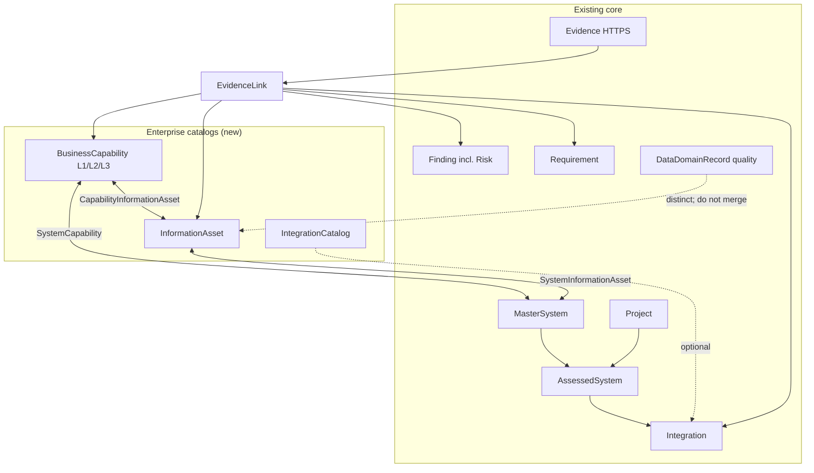
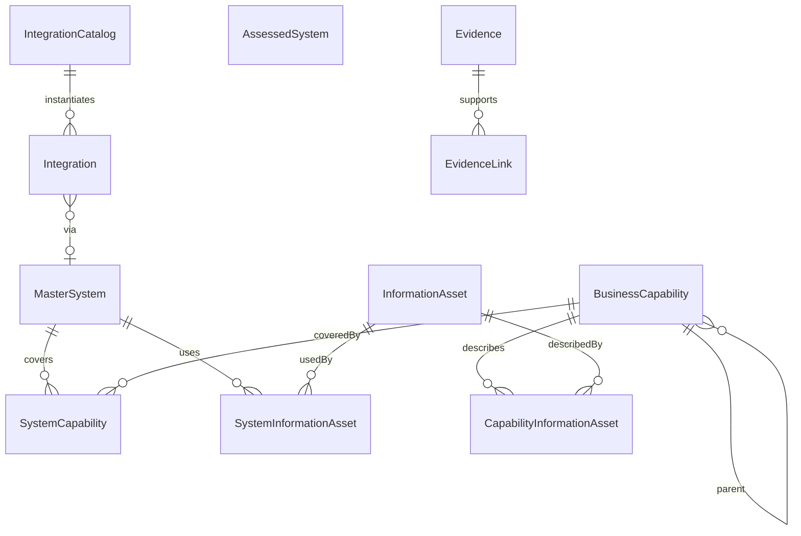

# SystemScope 2.0 Phase 1 — Structured Enterprise Registers

| Field | Value |
| --- | --- |
| **Document title** | SystemScope 2.0 Phase 1 — Structured Enterprise Registers |
| **Author** | SystemScope architecture (draft) |
| **Date** | 27 August 2026 |
| **Status** | In implementation — PRs 1–4 complete in this repository |
| **Scope** | Phase 1 only: Business Capability Model, Information Asset Register, Enhanced Integration Catalogue, Evidence Registry extension, Questionnaire Engine gaps, GWDB proving slice |
| **Codebase** | `c:\GitHub\SystemScope` (React 19 + .NET 10 + Azure SQL) |

---

## Implementation status (27 August 2026)

Work is against this design, in the current workspace (not yet split into GitHub PRs).

| PR | Scope | Status |
| --- | --- | --- |
| **1** | Catalog platform + business capabilities + GWDB coverage | **Done** |
| **2** | Information asset register + coverage-based scoring extras | **Done** |
| **3** | Integration type / protocol / format + reusable catalog | **Done** |
| **4** | HTTPS evidence multi-linking (`EvidenceLink`) | **Done** |
| **5** | Assessment template v2 (capability and information-asset questions) | Remaining |
| **6** | GWDB findings, requirements, search, documents, CSV | Remaining |
| **7** | Optional action finding/requirement FKs | Remaining (optional; not required to close Phase 1) |

**Shipped in PRs 1–4**

- Tenant-wide capability catalog (L1 Groundwater operations + five L2 capabilities) linked to `MasterSystem`; `#/capabilities`; system profile and assessment overview coverage.
- Information asset catalog (Bore, Aquifer, Water Level, Water Quality Result) with SoR-on-role; `#/information-assets`; Data tab lists; Architecture + Data Quality scoring extras. AQUIS completeness unchanged (24).
- Integration Type / Protocol / Data Format, `IntegrationCatalog` copy-on-instantiate, Method backfill, `#/integrations` columns.
- `EvidenceLink` many-to-many; five GWDB_* SMD HTTPS evidence rows; Add evidence is URL-based (“Register source & analyse”). Requirement/finding evidence links wait for PR 6 seed.

**Still to build for Phase 1**

- **PR 5:** Publish template v2; `GET /templates` latest version; Workshop start uses that version. Do not mutate v1.
- **PR 6:** GWDB findings (Oracle Forms dependency, RN-centric architecture, multiple external integrations) with `Finding.EvidenceId` on SMDs; three requirements and `RequirementFinding` joins; search facets/open for capabilities and assets; Word overview lists; CSV export kinds. `UpsertEndStateEvidenceLinks` already exists and will attach FUNDEF/finding links once those rows exist.
- **PR 7 (optional):** `AssessmentAction.FindingId` / `RequirementId`.

**Out of Phase 1 (roadmap Phase 2/3)** — not started: dedicated Risk register, Stakeholder/RACI registry, Decision/ADR register, capability heatmap, data-model repository (tables/columns/ERD), shared technology catalogue, end-to-end data-flow canvas, real LLM extraction, dual executive/architect dashboards, new assessment domains, Entra Architect/Analyst/Reviewer roles, file-upload evidence.

---

## Overview

SystemScope today is a working market-scan assessment platform. Systems are reusable master records (`MasterSystem`) placed in project scope as `AssessedSystem`. Business capability is a free-text string (`BusinessCapabilities` on both types). Integrations are rich but project-and-system-scoped rows with a free-text `Method`. Evidence is HTTPS-only, linked mainly through a single `EvidenceId` (plus `ResponseEvidence`). Workshop questionnaires exist and already exceed the PRD question-type list. The seeded Water Monitoring Systems Market Scan 2026 includes GWDB as an in-scope system (`catalogKey = "gwdb"`), but GWDB is only lightly populated compared with AQUIS.

Phase 1 introduces **enterprise catalog registers** that live beside the existing master-system pattern, not inside each assessed copy:

1. A hierarchical **Business Capability** catalog with system coverage links.
2. An **Information Asset** catalog distinct from quality-focused `DataDomainRecord`.
3. First-class **Integration Type / Protocol / Data Format** plus an optional reusable integration catalog row.
4. A many-to-many **Evidence link** table so the same HTTPS source can support capabilities, assets, integrations, findings and requirements.
5. A **template v2** increment that adds capability and information-asset questions without redesigning Workshop Mode.
6. **GWDB as the proving slice**: five capabilities, four assets, five SMD evidence links, conceptual findings and requirements.

The first PR does **not** drop `BusinessCapabilities`. The string is a **legacy projection** rewritten from coverage names; the UI reads coverage rows, not the string. Evidence stays HTTPS links; the PRD file-upload requirement remains an open follow-on.

---

## Background & Motivation

### Current state (verified in code)

| Area | Implementation |
| --- | --- |
| Master vs project system | `MasterSystem` in `src/SystemScope.Api/ScanDomain.cs`; `AssessedSystem` in `src/SystemScope.Api/Domain.cs`. Copy-on-scope via `ScanApi.CopyMaster`. |
| Capabilities | Free-text `BusinessCapabilities` on both types. Seeded for GWDB as `"Bores, water levels, water quality, drill logs, GWPlot."` (`ScanSeed.cs` specs array). |
| Integrations | `Integration` already has source, target, direction, method, volume, auth, encryption, transformation, retry, monitoring, replacement impact, evidence, validation. Bound to `ProjectId` + `SystemId`. Catalogue UI is `#/integrations` reading `GET /api/scan/integrations`. |
| Evidence | `Evidence` is title + HTTPS URL + metadata. `POST /api/evidence` and `POST /api/systems/{id}/evidence/analyse` reject non-HTTPS and unapproved hosts (`Evidence:ApprovedHosts` in `appsettings.json`). Attachments are not accepted. |
| Findings / risks | `Finding.Type` includes `Risk`. No separate Risk entity. High/Critical findings require evidence or `EvidenceGapRationale`. |
| Requirements | `Requirement` + `RequirementFinding`. No GWDB requirements are seeded today. |
| Actions | `AssessmentAction` has `ProjectId` and optional `SystemId` only — no finding/requirement FKs. |
| Questionnaire | `AssessmentTemplate` / `TemplateSection` / `Question`. Seeded template **"Oracle and Web Application Assessment"** with 10 sections × 2 questions. `QuestionType` already includes Text, RichText, YesNoUnknown, SingleChoice, MultipleChoice, Number, Date, Rating, Link, Relationship. |
| Data domains | `DataDomainRecord` is per-assessed-system and quality-oriented (completeness, accuracy, duplicates). Seeded only for AQUIS. |
| Search | In-memory `SearchIndex.Page` in `DemoViewsApi.cs` over systems, assessments, findings, evidence, documents, integrations. |
| Documents | `MarketScanDocument` in `ScanServices.cs` builds Word from facts, integrations, findings, gaps, requirements. No capability or information-asset chapters. |
| Landscape | Visual catalog in `src/systemscope-web/src/landscape/catalog.ts`. `Capability` there is a **swimlane grouping** (`groundwater`, `monitoring`, …) — not a business-capability register. |
| Schema | Forward-only SQL under `src/SystemScope.Api/database/migrations/` journaled in `dbo.App_Schema_Migrations`. Production path is `New-Migration.ps1` + `Run-Migrations.ps1` / hosted service, not EF `EnsureCreated`. |
| Identity | Entra JWT when configured; otherwise `DevelopmentAuthHandler`. Access **records** use `admin` / `user` (`AccessControl.cs` `AppIdentity.AdminRole` / `UserRole`). The development handler still emits `AssessmentLead` and `Administrator`; `CanManageUsers` already aliases `Administrator`. Do not add Architect/Analyst/Reviewer. |

### Pain points

- Free-text capabilities cannot answer “which systems provide Bore Registration?” or support a coverage list.
- Information assets (Bore, Aquifer) are conflated with, or missing from, data-quality domains and physical schema (Phase 3).
- Integration `Method` values in seed are `"Unknown"`, `"Application module"`, `"Application workflow"` — not the PRD types (API / Batch / File Transfer / Database Link / Event Driven / Manual).
- Evidence cannot be reused across registers; a GWDB SMD cannot legally support a capability, a finding and a requirement without duplicating rows or overloading `SystemId`.
- GWDB is in scope and on the landscape (`catalog.ts` id `gwdb`) but has only two architecture/database facts and one internal integration. The PRD GWDB use case is not demonstrable.

### Why now

`docs/SYSTEMSCOPE_PRODUCT_ROADMAP.md` Phase 1 is exactly this set. The Enterprise PRD §4, §6, §9, §11, §17 and §25 define field-level expectations. Implementing them as **catalog entities** (same idea as `MasterSystem`) avoids duplicating enterprise meaning into every `AssessedSystem` copy.

---

## Goals & Non-Goals

### Goals (Phase 1)

1. Replace *capture* of free-text capabilities with a structured L1/L2/L3 catalog and system coverage links, without dropping the legacy string in the first PR.
2. Introduce an Information Asset register independent of `DataDomainRecord` and of Phase 3 physical schema.
3. Add Integration Type, Protocol and Data Format as first-class fields; allow catalogue-level reuse of a logical integration.
4. Allow one HTTPS evidence record to be linked to capabilities, information assets, integrations, findings and requirements.
5. Extend the existing questionnaire template so new registers can be assessed; do not redesign Workshop Mode.
6. Seed GWDB as the vertical slice in the existing Water Monitoring Systems Market Scan 2026 project.
7. Reuse `Record`, `AuditService`, `/api` authorization, and forward-only SQL migrations. Catalog HTTP uses a **new** `MapCatalog` helper (list + CRUD + archive), not `MapRegister` (which is assessed-system child rows only).
8. Extend global search and show a simple coverage list on the system profile.
9. Keep APIs server-authorized; UI is not the security boundary.

### Non-goals (Phase 2/3 — mention only)

- Dedicated Risk register split from `Finding`.
- Stakeholder / RACI registry.
- Decision / ADR register.
- Full capability heatmap / overlap matrix UI (a **coverage list** on the system profile is in scope).
- Data Model Repository (logical entity / physical table / column / ERD / schema compare).
- Architecture Fact / shared Technology catalogue.
- End-to-end multi-system data-flow canvas (existing `DataFlow` / `BatchProcess` stay as-is).
- Real LLM AI Assessment Assistant (keep `ExtractedClaim` review workflow unchanged).
- Dual executive/architect dashboard rewrite.
- New assessment domains (Vendor, Cloud Readiness, Modernisation), except template questions for capabilities/assets.
- Changing Entra roles to Architect / Analyst / Reviewer / ReadOnly.
- 10,000-system / 1,000,000-evidence scale work. Design for current Azure SQL + EF patterns; record the NFR gap.

### Explicitly deferred follow-ons

- Finding/requirement FKs on `AssessmentAction` (not required for GWDB seed; AQUIS actions already work without them).
- File-upload evidence.
- Automatic PSPF ↔ information-asset classification conversion on systems.
- Organisation tenancy entity (does not exist today).

---

## Proposed Design

### Architecture

Capabilities and information assets are **tenant-wide catalog entities** (the Azure SQL database is the tenant; there is no `Organisation` row). They are linked to `MasterSystem`, not copied onto `AssessedSystem`. Project assessments *use* those links. Integrations remain project-scoped occurrences (validation, state, evidence are assessment facts) but may point at a reusable catalog row.



### Request flow (create capability and cover a system)

```mermaid
sequenceDiagram
  participant UI as SPA hash route
  participant API as /api (RequireAuthorization)
  participant DB as Azure SQL / InMemory
  participant Audit as AuditService

  UI->>API: POST /api/capabilities
  API->>API: Access gate already applied
  API->>DB: Insert BusinessCapability (Record)
  API->>Audit: Create / BusinessCapability
  API-->>UI: 201 + entity

  UI->>API: POST /api/master-systems/{id}/capabilities
  API->>DB: Insert SystemCapability (unique MasterSystemId+CapabilityId)
  API->>Audit: Create / SystemCapability
  API->>DB: Re-derive MasterSystem.BusinessCapabilities; mirror in-scope AssessedSystem rows
  API->>API: Recalculate only if scoring extras already shipped (PR 2+)
  API-->>UI: 201 + coverage row
```

### Why master/catalog, not per `AssessedSystem`

1. **Capture once, reuse many times** is already the product principle (`docs/SystemScope-Features.md`). `MasterSystem` exists so AQUIS/GWDB are not duplicated per project (`POST /api/projects/{id}/scope`).
2. A capability such as *Bore Registration* is an enterprise meaning. GWDB may provide it in 2026 and a replacement system may provide it in a later project. Duplicating the capability per `AssessedSystem` would fork names, owners and maturity.
3. There is **no Organisation entity**. Landscape is a JSON snapshot (`LandscapeSnapshot.Document`), not a relational parent. Scoping catalogs to landscape would couple structured data to a visual document. Phase 1 catalogs are **database-wide** (the Azure SQL database is the tenant). **Do not add `ProjectId`** to catalog or coverage tables in Phase 1. Project-private drafts and coverage overlays are a later unique-key design (`(MasterSystemId, CapabilityId, ProjectId)` with an enterprise sentinel), not a nullable column beside a two-part unique index.
4. Assessment-specific fields (validation, maturity, evidence) live on the **link** (`SystemCapability`), not on the capability definition. One coverage row per master + capability (a single `Role`).

### 1. Business Capability Model

#### Entity: `BusinessCapability` (`Record`)

| Field | Type | Notes |
| --- | --- | --- |
| `Id` | `Guid` | From `Record` |
| `CatalogKey` | `string` (max 64) | Unique, slug (`bore-registration`). Indexed. |
| `Name` | `string` (max 200) | Required. |
| `Description` | `string` | Business definition independent of systems. |
| `ParentId` | `Guid?` | Self-FK. Null = L1. |
| `Level` | `CapabilityLevel` | `L1`, `L2`, `L3`. Stored as int. Enforced: L1 has no parent; L2 parent is L1; L3 parent is L2. |
| `Domain` | `string` (max 100) | e.g. `Groundwater`. |
| `Category` | `string` (max 100) | PRD “Capability Category”. e.g. `Registration`, `Monitoring`. |
| `Criticality` | `Criticality` | Reuse existing enum (`Low`/`Moderate`/`High`/`Critical`). |
| `Owner` | `string` | Catalog owner (string, same as system owners today). |
| `DefaultMaturityScore` | `int?` | 1–5. Optional catalog default; coverage row may override. |
| `Archived` | `bool` | Soft delete. |

No `ProjectId` (Phase 1). Indexes: unique filtered `CatalogKey` where `Archived = 0` (so archive-and-recreate of the same slug is allowed); index on `ParentId`.

SQL (illustrative; generate via `New-Migration.ps1`):

```sql
ALTER TABLE dbo.BusinessCapabilities
    ADD CONSTRAINT FK_BusinessCapabilities_Parent
        FOREIGN KEY (ParentId) REFERENCES dbo.BusinessCapabilities (Id)
        ON DELETE NO ACTION;
CREATE UNIQUE INDEX UX_BusinessCapabilities_CatalogKey
    ON dbo.BusinessCapabilities (CatalogKey) WHERE Archived = 0;
```

**Create rules (API):**

- If `CatalogKey` is omitted, slug from `Name` with existing `ScanWorkspace.Slug`, truncated to 64 characters. Collision → 409, client must supply a distinct key.
- If `Level` is omitted, infer: no parent → `L1`; parent is L1 → `L2`; parent is L2 → `L3`. Reject if supplied `Level` does not match parent. Reject L3 parent (max depth 3). Refuse cycles (walk `ParentId`).
- Unique `CatalogKey` is enforced in the API for InMemory **and** SQL. Translate unique-index violations to **409** (not 500).
- **Refuse archive** of a parent that still has live (`Archived = 0`) children. **Also refuse** while live `SystemCapability` or `CapabilityInformationAsset` rows exist (client unlinks/archives those first). Do not cascade-archive. FKs are `ON DELETE NO ACTION`. Same rule on `InformationAsset`: refuse archive while live `SystemInformationAsset` or `CapabilityInformationAsset` exist.

#### Entity: `SystemCapability` (`Record`)

Coverage link. One row per master system + capability.

| Field | Type | Notes |
| --- | --- | --- |
| `MasterSystemId` | `Guid` | FK `MasterSystems`. |
| `CapabilityId` | `Guid` | FK `BusinessCapabilities`. |
| `Role` | `CapabilityCoverageRole` | `Provides`, `Supports`, `Consumes`. Default `Provides`. |
| `MaturityScore` | `int?` | 1–5. Null = use catalog default / not assessed. |
| `Notes` | `string` | |
| `State` | `InformationState` | Reuse (`Current`/`Future`/`Suspected`/`Retired`). Future coverage is not a current-state fact. |
| `Validation` | `ValidationStatus` | Reuse. |
| `EvidenceId` | `Guid?` | Convenience pointer; `EvidenceLink` is the many-to-many. |

No `ProjectId`. Unique filtered index `(MasterSystemId, CapabilityId)` where `Archived = 0`. One role per pair; change role with PUT, do not insert a second row. SQL FKs to `MasterSystems` and `BusinessCapabilities` are `ON DELETE NO ACTION`.

#### Derived / legacy `BusinessCapabilities`

Keep `MasterSystem.BusinessCapabilities` and `AssessedSystem.BusinessCapabilities` (`NVARCHAR(MAX) NOT NULL`). The string is a **legacy projection only** — not the display source of truth.

**Write path**

After every live `SystemCapability` create / update / archive for a master:

```text
names = current-state coverage where link.Archived = 0 AND capability.Archived = 0, names ordered by Level, Name
MasterSystem.BusinessCapabilities = string.Join("; ", names)
foreach in-scope AssessedSystem with that MasterSystemId:
    AssessedSystem.BusinessCapabilities = MasterSystem.BusinessCapabilities
```

`CopyMaster` still copies the master string at scope time (`ScanApi.cs` 816–825) so new project copies stay consistent.

`EnsurePhase1Registers` must also mirror the derived string onto the existing GWDB `AssessedSystem` (already in the 2026 project). Without that, the assessed row keeps `"Bores, water levels, water quality, drill logs, GWPlot."`.

**Ignore client writes** to `MasterSystemInput.BusinessCapabilities` on `POST/PUT /scan/systems` when the master has any live `SystemCapability`. Do not 400; persist other fields and leave the derived string as the coverage projection. When there is no coverage, free-text writes still work (AQUIS and new systems).

**Display path:** `ScanWorkspace.Payload` and `GET /scan/profile/{key}` return the **coverage array**, not the string. `Payload` today omits `businessCapabilities`; do not start treating the string as UI source. The market SPA has no `businessCapabilities` references.

**Do not drop the column in Phase 1.** Do not auto-parse comma-separated legacy text into catalog rows (`"Bores, water levels, water quality, drill logs, GWPlot."` would create junk names). Seed GWDB coverage explicitly; other systems keep the legacy string until an analyst maps them.

#### UI

`App.tsx` is not a generic router. `parseHash()` special-cases `search`, `documents`, `validate`, `assessments`, `systems`; everything else is `views.find(v => v.toLowerCase() === head)` where `views = Object.keys(icons)`. Unmatched views render a **blank main**. Nav labels with spaces cannot be hash slugs.

**Hash contracts (Phase 1):**

| Hash | View | `scanKey` |
| --- | --- | --- |
| `#/capabilities` | `Capabilities` | undefined — register list |
| `#/capabilities/{id}` | `Capabilities` | **Guid** of `BusinessCapability.Id` — selected row / side panel |
| `#/information-assets` | `InformationAssets` | undefined — register list |
| `#/information-assets/{id}` | `InformationAssets` | **Guid** of `InformationAsset.Id` |

`scanKey` in `App.tsx` is an **opaque id string** (the Guid), not a system `CatalogKey`. Search hits use `Hit.Id` (Guid) and open these hashes. Systems stay `#/systems/gwdb` because `GET /scan/profile/{key}` is key-based; catalog GET-by-id is identity-based.

`GET /capabilities/{id}` and `GET /information-assets/{id}`: bind `{id}` as string. If it parses as Guid, load by `Id`; else fall back to `CatalogKey` (same pattern as masters). The hash writer and search **always emit Guid**. A `{id:guid}`-only route would 404 on slugs; do not put CatalogKey in the hash.

**Required `App.tsx` changes (PR 1 for capabilities; PR 2 repeats the pattern):**

1. Add `icons` keys `Capabilities` and `InformationAssets` (values e.g. `▣` / `▦`). Do **not** use a label with a space as an `icons` key.
2. Special-case `parseHash` like `systems`: `head==='capabilities'` and `head==='information-assets'` set `view` + `scanKey=parts[1]`.
3. Hash writer in `go` / `useEffect`: `view==='Capabilities'` → `/capabilities` or `/capabilities/${scanKey}`; `InformationAssets` → `/information-assets` … Never `view.toLowerCase()` for assets (`informationassets` ≠ `information-assets`).
4. Render branches modelled on Systems: register when no id; selected row or side panel when id present. `inWorkspace` is true when `scanKey` is set so the page-heading chrome hides, same as system profile.
5. **CATALOGUE** nav group between the top group and GOVERNANCE. Nav today renders `{icons[x]} {x}`, so key `InformationAssets` would show as one word. Add a `navLabel` map (or `{ key, label }` items): `Capabilities` → “Capabilities”, `InformationAssets` → “Information assets”. Do not put a space in the `icons` key.

Register page: **flat list** with a Level column, search, filter by domain/level — modelled on `SystemsView`. No tree widget in Phase 1. GWDB seed is L1+L2 only; L3 remains supported by the API.

System profile (`SystemProfile.tsx` tabs today: Overview, Technology, Integrations, Data, Evidence, Findings, Documents, History): add **Capabilities** tab with a coverage list (name, level, role, maturity, validation). Overview also shows a compact chip list from the coverage array.

Assessment workspace: do **not** add a ninth scored domain and do **not** add “Business capabilities” to `COPY.Architecture.fields` in `AssessmentWorkspace.tsx`. **PR 1 must edit `AssessmentWorkspace.tsx` Overview** to render a compact coverage list from `data.capabilities` (name, role, maturity). **PR 2** adds the same for `data.informationAssets` on the Data tab (above data-quality domains). Without those file-list entries, scan Overview stays the AQUIS card copy and never shows Bore Registration.

Landscape swimlanes stay as they are (`assessment.ts` `Capability` union). Do not reuse that type name in the new API DTOs (`BusinessCapability` / `coverage`).

### 2. Information Asset Register

Distinct from `DataDomainRecord` (`ScanDomain.cs`), which is per-assessed-system and quality-centric. Phase 1 assets are **business data objects** (Bore, Aquifer), not tables (`GW_WLVDETS` is Phase 3).

#### Entity: `InformationAsset` (`Record`)

| Field | Type | Notes |
| --- | --- | --- |
| `CatalogKey` | `string` (max 64) | Unique slug (`bore`, `water-level`). |
| `Name` | `string` (max 200) | Required. |
| `Description` | `string` | Short description. |
| `BusinessDefinition` | `string` | PRD field. |
| `DataOwner` | `string` | |
| `Steward` | `string` | |
| `Classification` | `InformationAssetClassification` | **New enum**, not system `DataClassification`. |
| `RetentionPeriod` | `string` | Free text in Phase 1 (e.g. `7 years`, `Life of bore + 7`). |
| `RegulatoryRequirements` | `string` | |
| `Validation` | `ValidationStatus` | Catalog-level. |
| `EvidenceId` | `Guid?` | Convenience. |

No `ProjectId`. **No `SystemOfRecordMasterSystemId`.** System of record is **only** `SystemInformationAsset.Role = SystemOfRecord` (avoids a second source of truth). List/detail DTOs may include a derived `systemOfRecordName` from that link.

#### Enum: `InformationAssetClassification`

```csharp
public enum InformationAssetClassification
{
    Public = 0,
    Internal = 1,
    Sensitive = 2,
    Restricted = 3,
}
```

**Do not change** `MasterSystem.DataClassification` / `AssessedSystem.DataClassification` / `Evidence.Classification` (today default `"OFFICIAL"`). Those remain PSPF-style strings.

Informational mapping only (not written to system records):

| Information asset | Suggested system/evidence display |
| --- | --- |
| Public | Unofficial / publicly releasable (not currently stored on systems) |
| Internal | `OFFICIAL` |
| Sensitive | `OFFICIAL:Sensitive` if the organisation uses that marking |
| Restricted | Treat as higher-than-OFFICIAL; keep off external documents |

Mapping stays **documentation-only** in Phase 1 (Open Question 2). Do not persist a mapping table.

#### Entity: `SystemInformationAsset` (`Record`)

| Field | Type | Notes |
| --- | --- | --- |
| `MasterSystemId` | `Guid` | |
| `InformationAssetId` | `Guid` | |
| `Role` | `InformationAssetRole` | `SystemOfRecord`, `Producer`, `Consumer`, `Custodian`. |
| `State` | `InformationState` | |
| `Validation` | `ValidationStatus` | |
| `Notes` | `string` | |
| `EvidenceId` | `Guid?` | |

Unique filtered index `(MasterSystemId, InformationAssetId, Role)` where `Archived = 0` — one system may be SoR and also Custodian of the same asset as two rows. Additional filtered unique: at most one live `SystemOfRecord` per `InformationAssetId` (`UX_SystemInformationAssets_SoR ON (InformationAssetId) WHERE Role = 0 AND Archived = 0` with `SystemOfRecord = 0`). Second SoR → 409.

#### Entity: `CapabilityInformationAsset` (`Record`)

Many-to-many. Fields: `CapabilityId`, `InformationAssetId`, optional `Notes`. Unique filtered `(CapabilityId, InformationAssetId)` where `Archived = 0` — same pattern as the other junctions.

#### UI

Hash `#/information-assets` and `#/information-assets/{id}` as specified under Capabilities UI (PR 2). Register is a flat list. System profile **Data** tab gains an “Information assets” section **above** any data-quality domains, with an explicit caption that quality ratings remain on `DataDomainRecord`. Do **not** add “Information assets” to `COPY.DataQuality.fields`.

### 3. Enhanced Integration Catalogue

Keep every existing `Integration` field in `Domain.cs`. Add:

| Field | Type | Notes |
| --- | --- | --- |
| `IntegrationType` | `IntegrationType` | `Api`, `Batch`, `FileTransfer`, `DatabaseLink`, `EventDriven`, `Manual`. Default `Api` to match current `Method = "API"` default, but seed/migration will set from `Method`. |
| `Protocol` | `string` (max 100) | e.g. `HTTPS`, `SFTP`, `Oracle DB link`, `Oracle Forms module`. |
| `DataFormat` | `string` (max 100) | e.g. `JSON`, `XML`, `CSV`, `Fixed width`, `Relational`. |
| `CatalogId` | `Guid?` | FK `IntegrationCatalogs`. |

`Method` and `InterfaceType` remain. `Method` is the legacy free-text; UI prefers `IntegrationType` and still shows `Method` as “legacy / detail”.

#### Entity: `IntegrationCatalog` (`Record`)

Reusable logical integration, independent of a single assessed row.

| Field | Type | Notes |
| --- | --- | --- |
| `CatalogKey` | `string` (max 64) | Unique (`wfieldapp-gwdb-sample-metadata`). |
| `Name` | `string` | |
| `Purpose` | `string` | |
| `SourceMasterSystemId` | `Guid?` | Optional structured ends. |
| `TargetMasterSystemId` | `Guid?` | |
| `SourceLabel` | `string` | Fallback when an end is external / not a master. |
| `TargetLabel` | `string` | |
| `IntegrationType` | `IntegrationType` | |
| `Protocol` | `string` | |
| `DataFormat` | `string` | |
| `Frequency` | `string` | Default cadence. |
| `Criticality` | `string` | Match existing Integration criticality strings. |
| `SupportTeam` | `string` | PRD “Support Team”. |

No `ProjectId`. **Many project `Integration` occurrences may share one `IntegrationCatalog.Id`** (including across projects). That is a Key Decision.

**Copy-on-instantiate only — no live sync.** Creating a project `Integration` with `catalogId` copies name, purpose, source/target labels, type, protocol, format, frequency, criticality, support team onto the occurrence, then sets `ProjectId` + `SystemId` + `CatalogId`. Later catalog edits do **not** propagate. The occurrence remains the source of the dashboard graph, validation, and `#/integrations`.

There is no `POST /api/scan/integrations` today (list is GET; create is `POST /systems/{id}/integrations`). Accept `catalogId` on that POST and on `PUT /integrations/{id}`.

**`IntegrationInformationAsset` is out of Phase 1.** GWDB type/protocol/format does not need the junction. Revisit after PR 2 if a later slice wants “this occurrence moves Bore”.

#### Method → Type backfill

**One** forward-only `.sql` file: `ALTER` add columns **then** `UPDATE` existing rows in the same file, using `IF COL_LENGTH` / `COL_LENGTH IS NULL` guards. Default `IntegrationType = 0` (`Api`) is only the column default for the milliseconds before the UPDATE; the UPDATE must run in that migration. `20260824_002_assessment_application_relationships.sql` already inserted `Method = N'Unknown'` rows on Azure SQL independently of C# seed — those must be mapped to `Manual`.

Shared C# helper `IntegrationTypes.FromMethod(string method)` is used by:

1. The SQL backfill’s equivalent in-memory path (`EnsurePhase1Registers` / seed).
2. `ScanApi.ApplyIntegration` (`PUT /integrations/{id}`, `IntegrationScanInput`).
3. Skinny `POST /systems/{id}/integrations` in `Program.cs` (`IntegrationInput`): if `IntegrationType` is omitted, run `FromMethod(Method)`.

Mapping:

| Existing `Method` (observed) | `IntegrationType` | `Protocol` | `DataFormat` |
| --- | --- | --- | --- |
| `API` (entity default) | `Api` | `HTTPS` | `` (unknown) |
| `Unknown` | `Manual` | `` | `` |
| `Application module` | `Manual` | `Oracle Forms module` | `` |
| `Application workflow` | `Manual` | `` | `` |
| anything containing `batch` / `job` | `Batch` | `` | `` |
| `file` / `sftp` / `ftp` | `FileTransfer` | inferred | `` |
| `dblink` / `database link` | `DatabaseLink` | `Oracle DB link` | `Relational` |
| `event` / `queue` / `service bus` | `EventDriven` | `` | `` |
| else | `Manual` | leave `Method` as Protocol detail | `` |

Do not blank `Method`. In the **same PR** as the API fields, extend `GET /scan/integrations` with `integrationType`, `protocol`, `dataFormat`, `catalogId`, and add Type / Protocol / Format columns on `IntegrationsView` (`Registers.tsx`). Leaving GET/UI for a later PR would show empty Type.

### 4. Evidence Registry extension

**Policy unchanged:** HTTPS URL, optional `Evidence:ApprovedHosts` (`sharepoint.com`, `microsoft.com`). No binary upload in Phase 1. Seed URLs on `department.sharepoint.com` pass the host suffix check. **PR 4 must change Add Evidence copy** (`AddEvidence.tsx`) so Phase 1 does not promise “Upload and malware scan” / “Upload & analyse” as a real file upload — buttons stay URL-based (“Register source & analyse”).

Existing single FKs stay (`Finding.EvidenceId`, `Integration.EvidenceId`, `ScanFact.EvidenceId`, `Evidence.SystemId`). They are the primary/system context. New many-to-many:

#### Entity: `EvidenceLink` (`Record`)

| Field | Type | Notes |
| --- | --- | --- |
| `EvidenceId` | `Guid` | FK `Evidence`. |
| `EntityType` | `EvidenceEntityType` | See enum. |
| `EntityId` | `Guid` | Unguarded polymorphic id (same pattern as `AuditEvent.EntityType` + `EntityId`). |
| `Excerpt` | `string` | Optional supporting quote. |
| `SourceLocation` | `string` | Page, section, timestamp. |
| `ProjectId` | `Guid` | Denormalised from evidence for query. |

Unique `(EvidenceId, EntityType, EntityId)` where not archived.

```csharp
public enum EvidenceEntityType
{
    System = 0,
    Capability = 1,
    InformationAsset = 2,
    Integration = 3,
    Finding = 4,      // includes FindingType.Risk — no separate Risk target in Phase 1
    Requirement = 5,
}
```

`ResponseEvidence` is unchanged (workshop answers). `Evidence.SystemId` remains the **primary** system on the evidence row. `EvidenceEntityType.System` is for **additional** assessed systems (`EntityId` = `AssessedSystem.Id`). Linking the same id as `Evidence.SystemId` is allowed but redundant.

**Existence / project matrix (POST `/evidence/{id}/links`):**

| `EntityType` | Target must exist, not archived | Project rule |
| --- | --- | --- |
| `Capability` | `BusinessCapability` | Any evidence in the tenant (catalog has no project). |
| `InformationAsset` | `InformationAsset` | Any evidence in the tenant. |
| `Finding` | `Finding` | `Finding.ProjectId == Evidence.ProjectId`. |
| `Requirement` | `Requirement` | `Requirement.ProjectId == Evidence.ProjectId`. |
| `Integration` | `Integration` | `Integration.ProjectId == Evidence.ProjectId`. |
| `System` | `AssessedSystem` | `AssessedSystem.ProjectId == Evidence.ProjectId`. |

404 if the target type’s row is missing (enum values may exist before PR 2/3 tables if PR 4 lands first — then that type returns 400 “unsupported until register ships”). 409 on duplicate `(EvidenceId, EntityType, EntityId)`.

**GET shapes:**

- `GET /evidence/{id}/links` → `EvidenceLink[]` (include target name resolved server-side).
- `GET /evidence?entityType=&entityId=` extends today’s `projectId` / `systemId` filter. Response is the **existing evidence list shape** (no embedded links). Clients that need links call `/evidence/{id}/links`.

High/Critical findings still require `Finding.EvidenceId` **or** `EvidenceGapRationale` (`Program.cs` POST `/findings`). `EvidenceLink` alone does **not** satisfy that rule. GWDB High findings seed **must set `Finding.EvidenceId`** to the primary SMD (e.g. GWDB_CORE_SMD) and may add extra `EvidenceLink` rows.

UI: “Also link to” multi-select (type + picker) on Add Evidence and the profile Evidence tab.

**PRD conflict (file upload, types Interview/PDF/Screenshot, versioning):** Phase 1 keeps `SourceType` as a string. Versioning of bytes is out of scope. Follow-on (Open Question 1).

### 5. Questionnaire Engine (gaps only)

Do **not** redesign Workshop Mode (`App.tsx` `Workshop`, `POST /api/systems/{id}/assessments` snapshotting template version).

Existing `QuestionType` already **exceeds** PRD §17 (PRD: Yes/No, Rating, Text, Multi-select). Keep all current types.

Phase 1 work:

1. **Publish template v2** as a **new** `AssessmentTemplate` row named `"Oracle and Web Application Assessment"` with `Version = 2`. Never mutate v1 questions. `SeedData.Apply` only inserts v1 when `!await db.Templates.AnyAsync()`, so v2 seed must sit **outside** that `if`, upserted by `(Name, Version)`.

2. **Do not add `Question.RelatedRegister`.** Pickers are not in Phase 1. Workshop already branches only on `YesNoUnknown` vs textarea (`App.tsx` `Workshop`); `Relationship` / `Rating` would silently become textareas. Template v2 therefore uses only types the widget already renders:

   | Section | Questions |
   | --- | --- |
   | Capabilities | (1) RichText: “Which business capabilities does this system provide today? Record catalog names (e.g. Bore Registration) rather than free-form technology.” (2) YesNoUnknown: “Are there unresolved capability information gaps?” |
   | Information assets | (1) RichText: “Which business information assets is this system the system of record for?” (2) YesNoUnknown: “Are classification, retention or stewardship unresolved?” |

   No Relationship questions (they would be free-text traps). No Rating questions (no widget). Structured capture remains the catalog registers + coverage APIs.

3. **Workshop start must use the latest published version.** Today `App.tsx` `start()` posts `templates[0].id`, and `GET /templates` has **no `OrderBy`**, so v1 (inserted first) keeps winning. Change:

   - API: `GET /templates` → `OrderBy(x => x.Name).ThenByDescending(x => x.Version)`.
   - SPA: `templates.filter(t => t.name === 'Oracle and Web Application Assessment').sort((a,b) => b.version - a.version)[0]`.

   Starting an assessment still snapshots `TemplateId` + `TemplateVersion`. Existing in-flight assessments stay on v1. Do not rewrite AQUIS workshop responses.

4. Do not add Vendor / Cloud / Modernisation domains. Do not claim catalog pickers in Workshop.

### 6. GWDB proving slice

GWDB is already seeded (`ScanSeed.cs` key `gwdb`, name `Groundwater`, acronym `GWDB`) and in landscape (`catalog.ts` “Groundwater Database”). Facts today: front-end Oracle Forms / GWPlot; database Oracle Database; integration “GWDB drill log / plot tools”.

Phase 1 seed must be **idempotent** and must run even when `MarketScanSeed.Apply` returns early because `DOC-AQUIS-0001` exists (Azure SQL after first deploy). `DatabaseMigrationHostedService` calls `SeedData.Apply` on **every** process start. Add `MarketScanSeed.EnsurePhase1Registers(db)` called from `SeedData.Apply` **after** `MarketScanSeed.Apply`, always.

**Natural keys — every row type, checked in C# (InMemory + SQL).** Prefer un-archive + update over insert. Do not `Add` when a live or archived row with that key exists (un-archive if archived).

| Entity | Natural key |
| --- | --- |
| `BusinessCapability`, `InformationAsset`, `IntegrationCatalog` | `CatalogKey` (include archived; un-archive rather than insert) |
| `SystemCapability` | `(MasterSystem.CatalogKey, Capability.CatalogKey)` |
| `SystemInformationAsset` | `(MasterSystem.CatalogKey, Asset.CatalogKey, Role)` |
| `CapabilityInformationAsset` | `(Capability.CatalogKey, Asset.CatalogKey)` |
| Evidence | `(ProjectId, Title)` — also keep URL stable; if title exists with a different URL, update URL |
| `EvidenceLink` | `(Evidence.Title, EntityType, target CatalogKey or Finding.Title or Requirement.Title or Integration.Name)` |
| Finding | `(AssessedSystem.CatalogKey, Title)` |
| Requirement | `(ProjectId, Title)` |
| `RequirementFinding` | `(Requirement.Title, Finding.Title)` in that project |
| Integration occurrence | `(AssessedSystem.CatalogKey, Integration.Name)` — **UPDATE** type/protocol/format/`CatalogId`; never insert a second “Field application to Groundwater” (Azure SQL already has those from C# seed **and** `20260824_002`) |

`RemoveIncomplete` (`ScanSeed.cs` 149–176) must, from **PR 1 onward**, delete coverage/links for the project’s masters **before** deleting `MasterSystems`. Order: `EvidenceLink` → `SystemCapability` / `SystemInformationAsset` / `CapabilityInformationAsset` (as those tables exist) → existing child deletes → `MasterSystems`. Catalog **definitions** (`BusinessCapability`, `InformationAsset`, `IntegrationCatalog`) are tenant-wide: **do not delete them** on project reseed; `EnsurePhase1Registers` upserts them.

Smoke assertions are **per PR** (see seed delta). Do not assert findings/requirements until PR 6 creates them.

Evidence URLs follow the AQUIS pattern (`https://department.sharepoint.com/sites/systemscope/evidence/...`). They remain links, not uploads.

#### Seed delta per PR

The seed **contents tables below are end state**. `EnsurePhase1Registers` is one method that **grows each PR**. Each step no-ops when the natural key’s target type or row is absent (do not reference DbSets that are not in that PR’s tree). API 400 for unknown `EvidenceEntityType` does **not** make C# seed compile against missing entities.

**Evidence links must converge on every merge order.** Extract `UpsertEndStateEvidenceLinks(db)` and call it at the **end of every** `EnsurePhase1Registers` run from PR 4 onward (including later PR 2/3/5/6 process starts). It upserts **all end-state `EvidenceLink` rows whose targets currently exist** (idempotent; skip missing resolvers). PR 4 introduces evidence rows + the helper with System and capability resolvers. PR 2 adds the asset resolver and still calls the helper (no-op if evidence is not seeded yet). PR 3 adds the integration-occurrence resolver. PR 6 still **owns creating** findings/requirements, then the helper attaches FUNDEF/finding links. Allowed path **1 → 4 → 2 → 3 → 6** therefore still reaches CORE/AUX/DRILL/NGIS asset and integration links when PR 2/3 re-run the helper.

| PR | `EnsurePhase1Registers` delta | Smoke (throw on failure) |
| --- | --- | --- |
| **PR 1** | L1 + 5 L2 capabilities; GWDB `SystemCapability`; derive and mirror `BusinessCapabilities`; extend `RemoveIncomplete` (coverage before masters). | GWDB master has ≥5 live L2 `SystemCapability` rows. |
| **PR 2** | Four information assets; SoR via `Role`; `CapabilityInformationAsset`; `Score(..., extra)` + Recalculate extras; call `UpsertEndStateEvidenceLinks` if that helper exists (asset resolver). | After `Recalculate(db, aquis.Id)`, `scan.InformationCompleteness == Score(..., extra: null).Information`. Four live GWDB `SystemInformationAsset` SoR rows. |
| **PR 3** | `IntegrationCatalog` keys; **UPDATE** existing occurrences by `(AssessedSystem.CatalogKey, Name)`; call `UpsertEndStateEvidenceLinks` if present (integration resolver). | Named GWDB integrations exist exactly once each. |
| **PR 4** | Five GWDB_* SMD evidence rows by `(ProjectId, Title)`. Introduce `UpsertEndStateEvidenceLinks` (System + capability resolvers; asset/integration/finding/requirement resolvers only if those types already compile). | Five evidence titles exist once for the market-scan project. |
| **PR 5** | Template v2 by `(Name, Version)`. No GWDB register rows. Still call `UpsertEndStateEvidenceLinks` if present. | Template Version=2 exists. |
| **PR 6** | Three findings (`Finding.EvidenceId` = primary SMD); three requirements; `RequirementFinding` by `(Requirement.Title, Finding.Title)`; finding/requirement resolvers on `UpsertEndStateEvidenceLinks`. | No duplicate finding titles on GWDB; no duplicate requirement titles; AQUIS stored completeness still equals empty-extra `Score` if PR 2 extras are present. |

#### Seed contents (end state after PR 6)

**L1 capability**

| CatalogKey | Name | Level | Domain | Category | Criticality | Owner |
| --- | --- | --- | --- | --- | --- | --- |
| `groundwater-operations` | Groundwater operations | L1 | Groundwater | Value chain | Critical | Groundwater |

**L2 capabilities (PRD list)**

| CatalogKey | Name | Parent | Category | Criticality | Owner |
| --- | --- | --- | --- | --- | --- |
| `bore-registration` | Bore Registration | groundwater-operations | Registration | Critical | Groundwater |
| `water-level-monitoring` | Water Level Monitoring | groundwater-operations | Monitoring | Critical | Groundwater |
| `water-quality-monitoring` | Water Quality Monitoring | groundwater-operations | Monitoring | High | Groundwater |
| `pump-testing` | Pump Testing | groundwater-operations | Testing | High | Groundwater |
| `geological-logging` | Geological Logging | groundwater-operations | Logging | High | Groundwater |

No L3 in the GWDB slice (hierarchy is demonstrated by L1→L2). UI still supports L3.

**Information assets**

| CatalogKey | Name | Classification | SoR | Owner | Steward | Retention | Regulatory |
| --- | --- | --- | --- | --- | --- | --- | --- |
| `bore` | Bore | Sensitive | GWDB | Groundwater | Groundwater data steward | Life of bore + 7 years | Public Records Act 2023 (Qld) |
| `aquifer` | Aquifer | Internal | GWDB | Groundwater | Hydrogeology | Permanent | — |
| `water-level` | Water Level | Internal | GWDB | Groundwater | Groundwater data steward | 7 years | Public Records Act 2023 (Qld) |
| `water-quality-result` | Water Quality Result | Sensitive | GWDB | Groundwater | Water quality SME | 7 years | Information Privacy Act 2009 (Qld) where personal |

**Capability ↔ asset**

| Capability | Assets |
| --- | --- |
| Bore Registration | Bore |
| Water Level Monitoring | Bore, Aquifer, Water Level |
| Water Quality Monitoring | Bore, Water Quality Result |
| Pump Testing | Bore, Aquifer |
| Geological Logging | Bore |

**GWDB system coverage:** all five L2 capabilities `Provides` / `Current` / `AnalystReviewed`. All four assets: Bore, Aquifer, Water Level, Water Quality Result as `SystemOfRecord`.

**Evidence (HTTPS)**

| Title | URL | SourceType | Linked to |
| --- | --- | --- | --- |
| GWDB_CORE_SMD | `https://department.sharepoint.com/sites/systemscope/evidence/gwdb-core-smd` | Architecture diagram | System GWDB; capabilities Bore Registration, Water Level Monitoring; assets Bore, Water Level |
| GWDB_AUX_SMD | `.../gwdb-aux-smd` | Document | System; Pump Testing; Aquifer |
| GWDB_DRILL_SMD | `.../gwdb-drill-smd` | Document | Geological Logging; Bore; integration GWDB drill log / plot tools |
| GWDB_NGIS_SMD | `.../gwdb-ngis-smd` | Document | Water Level Monitoring, Water Quality Monitoring |
| GWDB_FUNDEF | `.../gwdb-fundef` | Document | System overview; requirements (API-first, modern UI, digital workflows) |

Classification `OFFICIAL`, Confidentiality `Internal`, Completeness `Complete`, Reliability `Medium`, Validated `false` (analyst still to confirm — consistent with AQUIS transcript).

**Findings (on GWDB assessed system)**

High findings set `Finding.EvidenceId` to the primary SMD (satisfies POST `/findings` if those rows are later edited through the API). Extra SMDs use `EvidenceLink`.

| Title | Type | Domain | Severity | `Finding.EvidenceId` |
| --- | --- | --- | --- | --- |
| Oracle Forms dependency | TechnicalDebt | Architecture | High | GWDB_CORE_SMD |
| RN-centric architecture | Constraint | Architecture | High | GWDB_CORE_SMD |
| Multiple external integrations | Dependency | Integrations | Moderate | GWDB_NGIS_SMD |

**Requirements (project-level, linked to those findings)**

| Title | Type | Category | Priority | Source |
| --- | --- | --- | --- | --- |
| API-first architecture | Technical | Architecture | Must | Oracle Forms dependency + RN-centric |
| Modern web UI | Technical | Architecture | Must | Oracle Forms dependency |
| Digital workflows | Technical | Functional | Should | RN-centric + multiple external integrations; also GWDB_FUNDEF |

**Integrations to enrich (existing rows)**

| Name | Type | Protocol | Format | CatalogKey |
| --- | --- | --- | --- | --- |
| GWDB drill log / plot tools | Manual | Oracle Forms module | Relational | `gwdb-gwplot-drn` |
| Field application to Groundwater | Api | HTTPS | JSON | `wfieldapp-gwdb-sample-metadata` |
| Bore Location System to Groundwater | DatabaseLink | Oracle DB link | Relational | `bls-gwdb-bore-location` |

**Derived `BusinessCapabilities` for GWDB master and its assessed row:**  
`Bore Registration; Geological Logging; Pump Testing; Water Level Monitoring; Water Quality Monitoring`  
(legacy `"Bores, water levels, water quality, drill logs, GWPlot."` overwritten by derivation once coverage exists).

### Scoring, landscape, dashboard, documents

#### Scoring rule (single; no variants)

`ScanScoring.Score` (`ScanServices.cs` 84–118) treats a required attribute as filled **only** when a non-future `ScanFact` exists whose `Attribute` equals the name and `IsFilled(Value)` is true. It has no optional-per-attribute switch.

**Do not** add `"Business capabilities"` or `"Information assets"` to `ScanScoring.RequiredAttributes`. **Do not** persist synthetic `ScanFact` rows. **Do not** add those names to `COPY.*.fields` in `AssessmentWorkspace.tsx`.

**Closed rule:** extra slots are **not applicable** until that master has at least one **live** coverage row of the relevant type. **Live** means `link.Archived = 0` **and** the capability/asset definition `Archived = 0`. When applicable, they are filled **only** by current-state live coverage, never by the legacy `BusinessCapabilities` string.

If the domain’s `DomainRequirement` is **Deferred**, extras are `(0, 0)` for that domain — same short-circuit as `Score` today (`applicable = 0` / `pct = 0`, omitted from `weightTotal`). Do not add extras after the Deferred ternary or a later deferred Architecture would re-enter the weighted average. AQUIS Security is Deferred today; Architecture and DataQuality are not.

| Domain | extraApplicable | extraFilled |
| --- | --- | --- |
| Architecture | 1 iff ≥1 live `SystemCapability` (link and capability not archived); else 0 | 1 iff ≥1 of those has `State == Current` |
| DataQuality | 1 iff ≥1 live `SystemInformationAsset` (link and asset not archived); else 0 | 1 iff ≥1 of those has `State == Current` |

Consequences:

- AQUIS (no coverage) → extras 0/0 → `InformationCompleteness` **unchanged**.
- New systems from `POST /projects/{id}/systems` (empty `BusinessCapabilities`, no coverage) → extras 0/0 → **not penalised**.
- GWDB after seed (five current-state capability links, four current-state asset links) → Architecture +1 filled, DataQuality +1 filled.
- Future-only coverage → applicable 1, filled 0 (future is not a current-state fact).

**Implementation:** extend `Score` with an optional extra argument that **defaults to an empty dictionary** so PR 1 `Recalculate` still compiles until PR 2:

```csharp
public static (int Information, int Validation, int Readiness, Dictionary<ScanDomainKind, int> DomainPercents) Score(
    IReadOnlyCollection<ScanDomainState> domains,
    IReadOnlyCollection<ScanFact> facts,
    IReadOnlyCollection<InformationGap> gaps,
    IReadOnlyCollection<ExtractedClaim> claims,
    IReadOnlyCollection<Finding> findings,
    IReadOnlyDictionary<ScanDomainKind, (int extraFilled, int extraApplicable)>? extra = null)
```

Per domain, after resolving `required` / `applicable` from `DomainRequirement`:

```csharp
if (required is DomainRequirement.Deferred) { extraFilled = 0; extraApplicable = 0; }
else extra.GetValueOrDefault(kind);
filled += extraFilled;
applicable += extraApplicable;
```

Then `pct = Percent(filled, applicable)` as today. `Recalculate` (PR 2) loads coverage for the assessed system’s `MasterSystemId` (live definitions only) and passes extras. Empty / null extra = today’s formula.

**PR split:** PR 1 does **not** change `Score()` (or adds only the optional unused parameter). PR 2 fills extras and both Architecture and DataQuality slots in one change.

**AQUIS regression (no xUnit project in this repo).** Do not hard-code a magic completeness percentage (it drifts when AQUIS facts change). Two in-memory `Score` calls with `extra: null` vs `extra: computed` are **tautological** for AQUIS (computed extras are 0/0 by the closed rule) and would not catch `Recalculate` applying **GWDB’s** extras to the AQUIS scan. The gate that matches “AQUIS `InformationCompleteness` is unchanged” is **stored completeness**:

1. `await ScanWorkspace.Recalculate(db, aquis.Id)` (the only production `Score` caller today).
2. Reload the AQUIS `ScanAssessment`.
3. Throw unless `scan.InformationCompleteness == Score(..., extra: null).Information`.

Optionally keep the two-`Score` comparison as a **sanity check** that extras computed for the AQUIS master are (0, 0) — not as the completeness gate. Phase 1 does not create a test project.

| Surface | Phase 1 behaviour |
| --- | --- |
| Dashboard | No new executive tiles. Relationship graph unchanged (still `Integration` occurrences). |
| Landscape | No rewrite. System details panel can later show catalog capabilities; Phase 1 skip. Do not confuse swimlane `Capability` with `BusinessCapability`. |
| Documents | `MarketScanDocument.SystemSection` is a **positional record** (`ScanServices.cs` ~546–560). Add optional `IReadOnlyList<string> Capabilities = []` and `InformationAssets = []` **with defaults** so the AQUIS seed constructor at `ScanSeed.cs` ~636 still compiles without new arguments. Update **three** call sites in PR 6: (1) `ScanApi` POST `/documents` constructor, (2) `ScanSeed.SeedWorkflow` constructor, (3) **`MarketScanDocument.Word`** (`ScanServices.cs` 393–397): after `Para(body, system.Overview)` emit Heading2 + bullets for non-empty capability and information-asset lists. Constructors alone will not put lists in the .docx. Stored `DOC-AQUIS-0001` bytes are not rewritten (`Apply` early-return). Integration lines include Type/Protocol/Format when set. |
| CSV export | Add **explicit** `kind` cases `capabilities` and `information-assets` on `GET /api/export/{id}/{kind}` **before** the systems fallback (`Program.cs` switch default is systems). |
| Search | `SearchIndex.Page` loads capabilities and assets. Facet objects in **both** the empty-query early return (`q.Length < 2`) **and** the full result must include `capabilities = 0` / `informationAssets = 0` (or counts). `SearchPage` TypeScript `Page.facets`, tabs, and `open()` ship in the same PR (PR 6): `Type === 'Capability'` → `#/capabilities/{id}`; `InformationAsset` → `#/information-assets/{id}`. Today `open()` sends every non-document/assessment hit to `onOpenSystem`. |

### Shared implementation patterns

- All new types inherit `Record` (`Id`, `CreatedAt`, `UpdatedAt`, `RowVersion`, `Archived`) in `Domain.cs` or a new `CatalogDomain.cs` to avoid growing the already dense files. Prefer **`CatalogDomain.cs`** + DbSets in `Data.cs`.
- `AuditService.Record` on create/update/archive. EntityType strings: `BusinessCapability`, `SystemCapability`, `InformationAsset`, `IntegrationCatalog`, `EvidenceLink`.
- Soft-archive, no hard delete (same as integrations “retired records can be archived”).
- Optimistic concurrency: keep `[Timestamp] RowVersion` like other records. Current PUT endpoints do **not** enforce `If-Match`; Phase 1 does not invent a new protocol.
- **`MapCatalog` is a new helper, not a clone of `MapRegister`.** `MapRegister<T,TInput>` (`ScanApi.cs` 843–868) is GET-by-assessed-system, POST-create, PUT-update; it uses `EF.Property<Guid>(x, "AssessedSystemId")`, calls `ScanWorkspace.Recalculate`, and has **no** GET-by-id, **no** list-all, **no** archive. The only `POST …/archive` today is documents (`WorkflowApi.cs`). `MapCatalog` in `CatalogApi.cs`:
  - GET list (filter/search) + GET by id + POST + PUT + POST `{id}/archive`
  - **No** `AssessedSystemId` requirement
  - **No** `Recalculate` on catalog definition writes
  - `Recalculate` **only** from `SystemCapability` / `SystemInformationAsset` writes (and only after PR 2 scoring extras exist; PR 1 coverage writes skip Score changes)
- Filtered unique indexes belong in **both** the SQL migration **and** `OnModelCreating` (`HasIndex().IsUnique().HasFilter("Archived = 0")`). `AppDbContext.OnModelCreating` today only sets `RequirementFinding` / `ResponseEvidence` keys and the `MasterSystem` relationship — no unique indexes. InMemory `EnsureCreated` will **not** enforce SQL filters; API uniqueness checks are mandatory, including archive-and-recreate of the same `CatalogKey`.
- SQL FKs: `ON DELETE NO ACTION` (including capability `ParentId` self-FK).
- Concurrent duplicate slug: catch unique-index violation → **409/400**, not 500.
- Authorization: routes hang off `var api = app.MapGroup("/api").RequireAuthorization();` (`Program.cs`). Access gate already blocks unapproved users. Access records stay `admin` / `user`.
- Seed cleanup: extend `RemoveIncomplete` in PR 1 (see GWDB seed natural keys).

---

## API / Interface Changes

All routes are under `/api`, authenticated. Enums serialise as strings (`JsonStringEnumConverter` already configured).

### Capabilities

| Method | Path | Body / query | Response |
| --- | --- | --- | --- |
| GET | `/capabilities` | `q?`, `level?`, `domain?`, `includeArchived=false` | `CapabilityDto[]` (include `parentName`, `level`, `systemCount`) |
| POST | `/capabilities` | `CapabilityInput` | 201 `BusinessCapability` |
| GET | `/capabilities/{id}` | `{id}` string: Guid or `CatalogKey` fallback | Detail + children + covering systems |
| PUT | `/capabilities/{id}` | `CapabilityInput` | 200 |
| POST | `/capabilities/{id}/archive` | | 200 archived |
| GET | `/master-systems/{id}/capabilities` | | `SystemCapabilityDto[]` |
| POST | `/master-systems/{id}/capabilities` | `SystemCapabilityInput` | 201 |
| PUT | `/system-capabilities/{id}` | `SystemCapabilityInput` | 200 |
| POST | `/system-capabilities/{id}/archive` | | 200 |

Also accept assessed-system id as alias: `GET/POST /systems/{id}/capabilities` resolves `MasterSystemId` so the assessment workspace does not need two identifiers.

```csharp
public record CapabilityInput(
    string Name,
    string? CatalogKey,
    string? Description,
    Guid? ParentId,
    CapabilityLevel? Level,
    string? Domain,
    string? Category,
    Criticality Criticality,
    string? Owner,
    int? DefaultMaturityScore);

public record SystemCapabilityInput(
    Guid CapabilityId,
    CapabilityCoverageRole Role,
    int? MaturityScore,
    InformationState State,
    ValidationStatus Validation,
    string? Notes,
    Guid? EvidenceId);
```

Validation: name required; maturity 1–5; parent/level consistency (infer Level if omitted); unique catalog key (409 on conflict); refuse archive of parents with live children.

### Information assets

Mirror capabilities: `/information-assets`, `/master-systems/{id}/information-assets`, `/system-information-assets/{id}`, plus `POST /capabilities/{id}/information-assets` for `CapabilityInformationAsset`.

```csharp
public record InformationAssetInput(
    string Name,
    string? CatalogKey,
    string? Description,
    string? BusinessDefinition,
    string? DataOwner,
    string? Steward,
    InformationAssetClassification Classification,
    string? RetentionPeriod,
    string? RegulatoryRequirements,
    ValidationStatus Validation,
    Guid? EvidenceId);
```

### Integrations

Extend `IntegrationScanInput` and `GET /scan/integrations` projection with `integrationType`, `protocol`, `dataFormat`, `catalogId`.

New:

| Method | Path |
| --- | --- |
| GET/POST | `/integration-catalog` |
| GET/PUT | `/integration-catalog/{id}` |
| POST | `/integration-catalog/{id}/archive` | via `MapCatalog`. Occurrence `CatalogId` may still point at an archived definition (copy-on-instantiate already snapshotted fields). |
| POST | `/systems/{id}/integrations` (existing) — accept new fields + optional `catalogId` (copy-on-instantiate) |
| PUT | `/integrations/{id}` (existing `ScanApi`) — `ApplyIntegration` writes new fields |

Keep `POST /systems/{id}/integrations` in `Program.cs` (`IntegrationInput`) working: if `Method` is supplied without `IntegrationType`, run `IntegrationTypes.FromMethod`. No `/integrations/{id}/information-assets` in Phase 1.

### Evidence links

| Method | Path |
| --- | --- |
| GET | `/evidence/{id}/links` |
| POST | `/evidence/{id}/links` body `EvidenceLinkInput(EntityType, EntityId, Excerpt?, SourceLocation?)` |
| POST | `/evidence-links/{id}/archive` |
| GET | `/evidence?entityType=&entityId=` — filter existing list |

Do not change HTTPS validation on `POST /evidence`.

### Questionnaire

Existing `POST /api/templates` still publishes a new version by name. Seed inserts v2 by `(Name, Version)` without mutating v1. `GET /templates` orders latest version first. No `RelatedRegister` column. No new routes.

### Search

`GET /search/page` facets become:

```csharp
{ systems, assessments, findings, evidence, documents, integrations, capabilities, informationAssets }
```

Empty-query early return in `SearchIndex.Page` (`q.Length < 2`) must use the **same** facet shape with zeros, including `capabilities` and `informationAssets`. Hits use `Type = "Capability"` | `"InformationAsset"` and `Id` = entity Guid. `SearchPage.open()` navigates to `#/capabilities/{hit.id}` / `#/information-assets/{hit.id}` (Guid, not CatalogKey). Facet TypeScript type changes **in PR 6** with the backend, not later.

### Workspace / profile payloads

`ScanWorkspace.Payload` (`ScanServices.cs`) adds:

```csharp
capabilities,           // coverage for this master
informationAssets,      // coverage for this master
```

`GET /scan/profile/{key}` (`DemoViewsApi.cs`) adds `capabilities` and `informationAssets` arrays for the profile tabs.

`GET /scan/systems` may include `capabilityCount` (optional, cheap).

---

## Data Model Changes



### SQL migration pattern

One forward-only file per PR. Implementers **must run** `.\database\New-Migration.ps1 add_business_capabilities` (and later slugs). The script sequences **per date**, not globally: on a new calendar day the next file is `yyyyMMdd_000_add_business_capabilities.sql`. The runner orders by filename, so `20260827_000_…` still applies after `20260824_005_…`. Do **not** hand-name `_006_`. Guard with `IF OBJECT_ID(...) IS NULL` / `IF COL_LENGTH(...) IS NULL`. Follow baseline style (`ROWVERSION`, `Archived`, `CreatedAt`/`UpdatedAt`). Catalog keys `NVARCHAR(64) NOT NULL`; names `NVARCHAR(200) NOT NULL`.

Suggested table names (plural, matching `MasterSystems`, `Integrations`):

- `dbo.BusinessCapabilities`
- `dbo.SystemCapabilities`
- `dbo.InformationAssets`
- `dbo.SystemInformationAssets`
- `dbo.CapabilityInformationAssets`
- `dbo.IntegrationCatalogs`
- `dbo.EvidenceLinks`

Alter `dbo.Integrations` in the **integrations PR** same file as backfill: `IntegrationType INT NOT NULL CONSTRAINT DF_Integrations_IntegrationType DEFAULT (0)`, `Protocol NVARCHAR(100) NOT NULL DEFAULT N''`, `DataFormat NVARCHAR(100) NOT NULL DEFAULT N''`, `CatalogId UNIQUEIDENTIFIER NULL`, then `UPDATE` from `Method`.

No `Questions.RelatedRegister`. No `ProjectId` on catalog/coverage tables. No `IntegrationInformationAssets`. No `InformationAssets.SystemOfRecordMasterSystemId`.

**Do not** add columns to drop `BusinessCapabilities`.

EF: `OnModelCreating` unique filtered indexes + FKs `ON DELETE NO ACTION`. Use `Record` on junctions for audit/archive (unlike `RequirementFinding`). EvidenceLink needs identity and archive.

### Seed vs Azure SQL

`MarketScanSeed.Apply` currently:

```csharp
if (await db.GeneratedDocuments.AnyAsync(x => x.ProjectId == existing.Id && x.RecordId == "DOC-AQUIS-0001"))
    return;
```

Production Azure SQL that already has the AQUIS document **will not re-enter Apply**. Phase 1 seed **must not live only inside Apply**. `EnsurePhase1Registers` upserts using the natural-key table in the GWDB proving-slice section (not only `CatalogKey` / evidence title).

---

## Alternatives Considered

### A. Store capabilities as JSON on `MasterSystem`

- **Pros:** No new tables; tiny PR.
- **Cons:** Cannot search/filter/cover across systems; no L1/L2/L3 integrity; blocks Phase 2 matrix. Rejected.

### B. Duplicate capability rows per `AssessedSystem` (like `DataDomainRecord`)

- **Pros:** Fits `MapRegister` exactly; project isolation is automatic.
- **Cons:** Forks “Bore Registration” per project; contradicts MasterSystem reuse; heatmap becomes a join nightmare. Rejected. Project overlay on the link is **not** in Phase 1 (no `ProjectId` column).

### C. Split Risk from Finding in Phase 1 because evidence must link to risks

- **Pros:** Matches PRD §13.
- **Cons:** Explicitly out of scope. `FindingType.Risk` plus `EvidenceEntityType.Finding` covers GWDB. Deferred.

### D. Replace `Integration` with only `IntegrationCatalog`

- **Pros:** True reuse, one row per interface.
- **Cons:** Breaks project validation, `InformationState`, dashboard graph, `20260824_002` migration, per-system assessment tab. Hybrid (catalog + occurrence) is chosen.

### E. File-upload evidence now to match PRD §11

- **Pros:** Matches PRD.
- **Cons:** Current security rule rejects attachments; malware scan, blob storage, classification-at-rest, App Service limits are a separate design. Phase 1 keeps HTTPS. Deferred.

### F. Use landscape JSON as the capability model

- **Pros:** Swimlanes already group groundwater/monitoring.
- **Cons:** Those are visual clusters, not L1–L3 business capabilities; landscape document is not relational. Rejected.

---

## Security & Privacy Considerations

| Threat | Severity | Mitigation |
| --- | --- | --- |
| Unauthenticated catalog writes | High | All new routes on `/api` `RequireAuthorization`; access gate (`UseApplicationAccessGate`) already runs before authorization. |
| UI-only hiding of Restricted assets | High | Server returns full catalog to any approved user in Phase 1 (same as systems). Do **not** claim field-level RBAC. Document as gap vs PRD roles Architect/Analyst/Reviewer/ReadOnly. |
| Evidence host injection / SSRF via URL | Medium | Existing HTTPS + `ApprovedHosts` checks reused; links table does not accept URLs. |
| Attachment malware | High (if PRD upload were enabled) | Not enabled. |
| Cross-project evidence linking leaking Restricted SMDs | Medium | Evidence remains project-scoped (`Evidence.ProjectId`). Linking a project evidence row to an enterprise capability exposes the **title** of that evidence on the capability detail to any approved user. Phase 1: show title + project name; URL still requires being able to call `GET /evidence`. Acceptable for current single-tenant demo; revisit with Organisation isolation. |
| Classification mismatch (OFFICIAL vs Restricted) | Medium | Separate enums; documents continue to use system/evidence `OFFICIAL` and existing visibility (`VisibilityClass`). Restricted information assets are not automatically added to external Word output. |
| Privilege escalation via polymorphic `EvidenceLink.EntityId` | Medium | API verifies target existence and project consistency for project-owned entities. |
| Seed URLs on public SharePoint paths | Low | Same dummy host as AQUIS walkthrough; not real holdings. |

AuthZ: access records stay `admin` / `user`. Development JWT still uses AssessmentLead / Administrator; `CanManageUsers` already aliases Administrator. Any approved user may mutate catalogs (same as systems/integrations today). Archive instead of delete.

---

## Observability

- **Audit:** every catalog create/update/archive via `AuditService` (`Data.cs`). Audit UI (`#/audit`) already lists `EntityType` + detail — new types appear without UI change.
- **Logging:** reuse API exception handler / `ProblemDetails`. No new telemetry backend exists; do not add App Insights in this phase unless already present in hosting.
- **Metrics (if/when ILogger is enough):** warn on Method→Type fallback `Unknown`/`Manual` counts during migration.
- **Alerting:** none new. Failed migrations already throw (`New-Migration.ps1` placeholder `THROW`; runner journal).
- **Search latency:** `SearchIndex.Page` already loads full tables into memory (NFR gap vs 10k systems). Adding two small catalogs (tens of rows) is negligible. Do not introduce SQL full-text in Phase 1. When extending facets, update the empty-query zero object in the same change.

---

## Rollout Plan

1. **Feature shape:** no feature-flag framework exists. Ship behind incremental PRs; each PR is mergeable and demoable on in-memory seed.
2. **Local:** `dotnet run` Development applies pending SQL if Azure SQL configured, else in-memory + `SeedData.Apply` including `EnsurePhase1Registers`.
3. **Azure SQL:** `Run-Migrations.ps1` then recycle Web App so seed hosted path runs `EnsurePhase1Registers` (must not depend on Apply early-return).
4. **UI:** hash routes are additive; old bookmarks keep working.
5. **Rollback:** forward-only SQL — rollback = new migration that archives/disables rather than DROP. UI rollback = revert the SPA PR; unused tables are harmless.
6. **AQUIS non-regression:** PR 1 must not change AQUIS `InformationCompleteness`. PR 2 seed smoke: after `Recalculate(db, aquis.Id)`, stored `scan.InformationCompleteness` equals `Score(..., extra: null).Information` (no magic percentage). Do not rewrite stored `DOC-AQUIS-0001` bytes; do update both `SystemSection` constructors **and** `MarketScanDocument.Word` so lists appear in newly generated .docx.

---

## Risks

| Risk | Severity | Mitigation |
| --- | --- | --- |
| Seed vs production Azure SQL (`Apply` early-return) | **High** | `EnsurePhase1Registers` always; C# natural keys for every row type; `RemoveIncomplete` deletes coverage before masters; smoke checks (≥5 GWDB coverage, no duplicate finding titles). |
| Scoring regression on AQUIS | **High** | Do not add names to `RequiredAttributes`; extras not applicable until that master has coverage; PR 1 does not change `Score()`; PR 2 smoke compares stored completeness after Recalculate to empty-extra `Score`. |
| Duplicate findings/requirements/integrations on every App start | **High** | Upsert by title / (system, name); never `Add` blindly. |
| `RemoveIncomplete` FK failure after PR 1 | **High** | Delete `SystemCapability` (and later joins) before `MasterSystems`. |
| Classification mismatch (PSPF OFFICIAL vs PRD Public/Internal/Sensitive/Restricted) | **Medium** | Separate enum; mapping table is documentation-only. |
| Evidence policy vs PRD upload | **Medium** | Explicit non-goal; UI copy should not promise upload in Phase 1 (optional string tweak on Add Evidence). |
| Optimistic concurrency unused on PUT | **Low** | Same as rest of API; RowVersion still present for future If-Match. |
| Polymorphic evidence links without DB FK | **Medium** | API existence checks; unique index; archive not cascade-delete. |
| Naming clash “Capability” in landscape vs catalog | **Low** | API/DTO name `BusinessCapability`; UI label “Business capabilities”. |
| `NVARCHAR(MAX)` unique indexes illegal for CatalogKey | **Medium** | Use `NVARCHAR(64) NOT NULL` for keys (unlike baseline MAX columns). |
| In-memory provider ignoring filtered unique indexes | **Low** | Enforce in API; tests via seed idempotency. |
| 10k systems / 1M evidence NFRs | **Low for Phase 1** | Record gap; current search already does not scale. |
| Template v2 unused because `start()` posts `templates[0]` | **Medium** | Order `GET /templates` by version desc; SPA selects latest published by name. |

---

## Open Questions

Schema-affecting questions that used to sit here (catalog `ProjectId`, scoring special-case, integration catalog cardinality, nav grouping, `Question.RelatedRegister`) are **closed** in Key Decisions. Remaining follow-ons:

1. **Evidence file upload:** PRD §11 wants upload, tagging, versioning. Current product forbids attachments. When (if ever) should a later phase introduce blob storage, and does that replace HTTPS or sit beside it?
2. **Classification mapping:** Keep information-asset classification fully separate, or persist an official mapping used in generated documents? Phase 1 is documentation-only.
3. **Capability hierarchy UI:** Phase 1 default is a **flat list with a Level column**. A tree widget is optional later. GWDB seed is L1+L2; API still allows L3.
4. **Landscape vs catalog:** Should landscape swimlanes later bind to `BusinessCapability` L1 rows, or remain visual clusters?
5. **Action FKs:** Add `FindingId` / `RequirementId` on `AssessmentAction` as a tiny follow-on (optional PR 7), or leave until Phase 2?

---

## Key Decisions

1. **Capabilities and information assets are tenant-wide catalog entities linked to `MasterSystem`, not copied onto `AssessedSystem`.** Matches existing master-system reuse and “capture once”. Project assessments display the master’s coverage.
2. **Do not drop `BusinessCapabilities` in the first PR.** The string is a legacy projection rewritten from coverage; display is the coverage array; ignore client writes to the string when live coverage exists; do not auto-parse commas.
3. **Information-asset classification is a new enum.** System/evidence `OFFICIAL` is untouched. Mapping is documentation-only.
4. **Integrations stay occurrence rows; `IntegrationCatalog` is optional reuse.** Copy-on-instantiate only; no live sync. Avoids breaking the dashboard graph and per-system validation.
5. **`Method` is retained; `IntegrationType`/`Protocol`/`DataFormat` are additive.** One SQL file adds columns and backfills; `FromMethod` runs on both create paths; unknown → `Manual`.
6. **Evidence remains HTTPS links.** New `EvidenceLink` table for many-to-many. Risks are Findings with `Type = Risk`. High findings still set `Finding.EvidenceId`.
7. **Questionnaire: publish template v2 as a new row; never mutate v1.** Workshop start uses the latest published version by name. v2 questions are RichText + YesNoUnknown only.
8. **GWDB seed is idempotent** (`EnsurePhase1Registers` after `Apply`, natural keys in C#, `RemoveIncomplete` extended) and runs even when AQUIS document seed short-circuits.
9. **No new identity roles.** Access records stay `admin`/`user`; development handler still emits AssessmentLead/Administrator; `CanManageUsers` already aliases Administrator.
10. **Schema changes are forward-only `.sql` files** created with `New-Migration.ps1` (per-date sequence, not a global `_006_`), not EF EnsureCreated.
11. **Landscape `Capability` swimlanes are a different concept** and are not reused.
12. **Actions do not gain finding/requirement FKs in Phase 1.**
13. **Phase 1 UI is register pages + system profile coverage list**, not a heatmap. Nav is a **CATALOGUE** group with a `navLabel` map. Hash contracts: `#/capabilities[/{guid}]`, `#/information-assets[/{guid}]` (`scanKey` is opaque Guid). Flat list with Level column. Assessment Overview/Data show coverage lists.
14. **New code goes in `CatalogDomain.cs` + `CatalogApi.cs`.** `MapCatalog` is a **new** helper (list + CRUD + archive), not `MapRegister`.
15. **Scoring extras are not `RequiredAttributes`.** They are not applicable until **that master** has **live** coverage (link and definition not archived); Deferred domains ignore extras; when applicable they are filled only by current-state coverage, never by the legacy string. PR 2 seed smoke: after Recalculate, AQUIS **stored** `InformationCompleteness` equals empty-extra `Score`. PR 1 does not change completeness.
16. **No `ProjectId` on catalog or coverage tables in Phase 1.** Database-wide tenant catalog. Overlays need a later unique-key design.
17. **Many `Integration` occurrences may share one `IntegrationCatalog` id**, including across projects.
18. **No `Question.RelatedRegister` column.** No Relationship/Rating questions in v2 (widgets would not render). No `IntegrationInformationAsset` table in Phase 1. SoR lives only on `SystemInformationAsset.Role`.
19. **Coverage unique keys:** `SystemCapability` `(MasterSystemId, CapabilityId)` filtered; `SystemInformationAsset` `(MasterSystemId, InformationAssetId, Role)` filtered plus at most one live SoR per asset; every junction uses the same `Archived = 0` unique pattern.

---

## References

- `docs/SYSTEMSCOPE_PRODUCT_ROADMAP.md` — Phase 1 feature list
- `docs/SystemScope_Enterprise_PRD.md` — §4 Capability, §6 Information Asset, §9 Integration, §11 Evidence, §17 Assessment, §25 GWDB
- `docs/SystemScope-Features.md` — implemented behaviour
- `docs/SystemScope_Market_Scan_Requirements.md` — FR-003 systems, FR-008 integrations, FR-010 data domains, FR-019 search
- `src/SystemScope.Api/Domain.cs` — `Record`, `AssessedSystem`, `Integration`, `Evidence`, `Finding`, `Requirement`, `AssessmentAction`, `Question`
- `src/SystemScope.Api/ScanDomain.cs` — `MasterSystem`, `DataDomainRecord`, enums
- `src/SystemScope.Api/ScanApi.cs` — `MapRegister`, integration catalogue, evidence analyse
- `src/SystemScope.Api/ScanSeed.cs` — Water Monitoring Systems Market Scan 2026, GWDB spec
- `src/SystemScope.Api/ScanServices.cs` — scoring, workspace payload, Word generation
- `src/SystemScope.Api/DemoViewsApi.cs` — profile + `SearchIndex`
- `src/SystemScope.Api/Program.cs` — evidence HTTPS rules, `/api` authorization
- `src/SystemScope.Api/Data.cs` — `AppDbContext`, `AuditService`, `SeedData`
- `src/SystemScope.Api/database/migrations/` + `New-Migration.ps1`
- `src/systemscope-web/src/App.tsx` — hash routes, nav
- `src/systemscope-web/src/market/Registers.tsx`, `SystemProfile.tsx`, `SearchPage.tsx`, `types.ts`
- `src/systemscope-web/src/landscape/catalog.ts` — GWDB box
- `src/SystemScope.Api/appsettings.json` — `Evidence:ApprovedHosts`

---

## PR Plan

Each PR is independently reviewable. Typical register PRs stay “entity + DbSet + migration + `/api` + React screen + seed”. PR 1 is larger because it introduces the catalog platform (`CatalogDomain` / `CatalogApi` / `MapCatalog` / `EnsurePhase1Registers`); it does **not** also change completeness scoring.

### PR 1 — Catalog platform + business capabilities + GWDB coverage

- **Status:** Done (in repo)
- **Title:** Add structured business capability catalog and GWDB coverage
- **Depends on:** none
- **Files / components:**
  - `src/SystemScope.Api/CatalogDomain.cs` (new): `BusinessCapability`, `SystemCapability`, enums
  - `src/SystemScope.Api/CatalogApi.cs` (new): `MapCatalog` (list/CRUD/archive — **not** `MapRegister`) + capability routes; 409 on duplicate `CatalogKey`
  - `src/SystemScope.Api/Data.cs`: DbSets + `OnModelCreating` filtered unique indexes + FKs
  - `src/SystemScope.Api/Program.cs`: `api.MapCatalog()`
  - `src/SystemScope.Api/ScanApi.cs`: ignore `MasterSystemInput.BusinessCapabilities` on POST/PUT `/scan/systems` when live coverage exists
  - Migration via `.\database\New-Migration.ps1 add_business_capabilities` (do not force `_006_`)
  - `src/SystemScope.Api/ScanSeed.cs`: `EnsurePhase1Registers` after `Apply`; **PR 1 delta only** (L1 + 5 L2 + GWDB coverage; derive **and mirror** `BusinessCapabilities`; extend `RemoveIncomplete`; smoke ≥5 coverage). Do not seed assets/evidence/findings.
  - `src/SystemScope.Api/ScanServices.cs`: include `capabilities` on workspace **payload only**. **Do not change `Score()` or `RequiredAttributes`.** Optional unused `extra` parameter is allowed if it keeps Recalculate compiling.
  - `src/SystemScope.Api/DemoViewsApi.cs`: profile coverage list + chips
  - `src/systemscope-web/src/App.tsx`: `icons.Capabilities`, `navLabel` map, `parseHash` branch `capabilities`, CATALOGUE nav group, render `CapabilitiesView`, `inWorkspace` when `scanKey` set; hash `{id}` is Guid
  - `CapabilitiesView.tsx` (or `Registers.tsx`): flat list + Level column; `#/capabilities` and `#/capabilities/{guid}`
  - `src/systemscope-web/src/market/SystemProfile.tsx`: Capabilities tab + overview chips
  - `src/systemscope-web/src/market/AssessmentWorkspace.tsx`: Overview compact list from `data.capabilities` (no new domain tab, no `COPY.Architecture.fields` change)
  - `src/systemscope-web/src/market/types.ts`
- **Description:** Catalog platform + L1/L2/L3 capabilities linked to `MasterSystem`. Keep the legacy string as a projection. Seed GWDB coverage only. Completeness formula unchanged (AQUIS cannot regress).

### PR 2 — Information asset register + scoring extras

- **Status:** Done (in repo)
- **Title:** Add information asset catalog and coverage-based scoring extras
- **Depends on:** PR 1 (capability–asset links and `Score` extra slots)
- **Files / components:**
  - `CatalogDomain.cs`: `InformationAsset`, `SystemInformationAsset`, `CapabilityInformationAsset`, enums (no SoR FK on the asset)
  - `CatalogApi.cs`: asset routes + `App.tsx` `#/information-assets[/{id}]` pattern from PR 1
  - `.\database\New-Migration.ps1 add_information_assets`
  - `ScanSeed.cs`: **PR 2 delta** — four assets + SoR-via-role + `CapabilityInformationAsset`; call `UpsertEndStateEvidenceLinks` if present (asset resolver); after `Recalculate(db, aquis.Id)` throw unless stored `InformationCompleteness == Score(..., extra: null).Information`
  - `ScanServices.cs`: `Score(..., extra)` as specified (Deferred short-circuit; live = link **and** definition not archived); Architecture + DataQuality extras
  - `DemoViewsApi.cs` / `SystemProfile.tsx` Data tab section; `InformationAssetsView`
  - `AssessmentWorkspace.tsx` Data tab: compact list from `data.informationAssets` above data-quality domains
  - `App.tsx`: `#/information-assets[/{guid}]`, `navLabel` “Information assets”
  - Do not add names to `COPY.*.fields`
- **Description:** Business data objects with PRD fields and separate classification enum. One `Score()` change for both extra slots.

### PR 3 — Integration type, protocol, format, and catalog reuse

- **Status:** Done (in repo)
- **Title:** Enhance integration catalogue with type/protocol/format and reusable catalog rows
- **Depends on:** none (independent of PR 2)
- **Files / components:**
  - `Domain.cs` / `CatalogDomain.cs`: `IntegrationType`, extra fields on `Integration`, `IntegrationCatalog` (no `IntegrationInformationAsset`)
  - `IntegrationTypes.FromMethod` shared helper
  - `ScanApi.ApplyIntegration`, `IntegrationScanInput`, **`GET /scan/integrations` projection includes type/protocol/format/catalogId**
  - `Program.cs` skinny `IntegrationInput` path also runs `FromMethod`
  - One SQL file: ALTER columns + UPDATE backfill (`Unknown` → Manual, including `20260824_002` rows)
  - `ScanSeed.cs`: **PR 3 delta** — upsert catalog keys; **UPDATE** existing GWDB-related occurrences by `(AssessedSystem.CatalogKey, Name)`; call `UpsertEndStateEvidenceLinks` if present (integration resolver)
  - `CatalogApi.cs`: `POST /integration-catalog/{id}/archive`
  - `Registers.tsx` `IntegrationsView`: Type / Protocol / Format columns **in this PR**
  - Assessment integrations tab: new fields
- **Description:** Additive columns; keep `Method`; copy-on-instantiate; many occurrences may share one catalog id.

### PR 4 — Evidence multi-linking

- **Status:** Done (in repo)
- **Title:** Allow HTTPS evidence to link to capabilities, assets, integrations, findings and requirements
- **Depends on:** PR 1 (can land before PR 2/3; unsupported `EntityType` values return 400 until those registers exist)
- **Files / components:**
  - `EvidenceLink` + `EvidenceEntityType`
  - `.\database\New-Migration.ps1 add_evidence_links`
  - `POST /api/evidence/{id}/links` with the existence/project matrix; `GET /evidence/{id}/links`; `GET /evidence?entityType=&entityId=` (existing list shape)
  - Keep HTTPS validation unchanged
  - `ScanSeed.cs`: **PR 4 delta** — five GWDB_* SMD evidence rows by `(ProjectId, Title)`; introduce `UpsertEndStateEvidenceLinks` and call it at the end of `EnsurePhase1Registers` (System + capability resolvers; other types only if they already compile). **Do not** create findings/requirements here.
  - `AddEvidence.tsx`: copy that does **not** promise file upload; “Also link to”
  - Profile Evidence tab
- **Description:** No file upload. High findings still use `Finding.EvidenceId` (set in PR 6). Risks use `Finding` links.

### PR 5 — Questionnaire template v2

- **Status:** Remaining
- **Title:** Publish assessment template v2 with capability and information-asset questions
- **Depends on:** none strictly; after PR 1–2 is enough for question wording. Parallel with PR 3–4.
- **Files / components:**
  - `SeedData` / `ScanSeed`: insert `AssessmentTemplate` Version=2 by name+version (outside the `!Templates.Any()` block; never mutate v1)
  - `Program.cs` `GET /templates` `OrderBy Name, Version DESC`
  - `App.tsx` `start()`: latest published `"Oracle and Web Application Assessment"`
  - No `RelatedRegister` column; no Workshop picker; RichText + YesNoUnknown only
- **Description:** Existing assessments remain on v1. Widgets already support the types used.

### PR 6 — GWDB findings, requirements, search, documents, CSV

- **Status:** Remaining
- **Title:** Complete GWDB proving slice and surface new registers in search and documents
- **Depends on:** PR 1–4 (not PR 5)
- **Files / components:**
  - `ScanSeed.cs`: **PR 6 delta** — three findings by `(CatalogKey, Title)` with `Finding.EvidenceId` = SMD; three requirements by `(ProjectId, Title)`; `RequirementFinding` by `(Requirement.Title, Finding.Title)`; finding/requirement resolvers on `UpsertEndStateEvidenceLinks` (helper still upserts any previously skipped asset/integration links); smokes including stored AQUIS completeness vs empty-extra `Score`
  - `SearchIndex.Page` in `DemoViewsApi.cs`: hits (`Id` = Guid) + **empty-query facet zeros** including `capabilities` / `informationAssets`
  - `SearchPage.tsx`: facet type, tabs, `open()` to `#/capabilities/{guid}` and `#/information-assets/{guid}`
  - `MarketScanDocument.SystemSection`: optional lists with defaults
  - `MarketScanDocument.Word`: after `Para(body, system.Overview)`, Heading2 + bullets for non-empty capability/asset lists
  - `ScanApi` POST `/documents` **and** `ScanSeed.SeedWorkflow` constructors
  - `GET /api/export/{id}/{kind}`: explicit `capabilities` and `information-assets` cases **before** the systems fallback
- **Description:** Makes `#/systems/gwdb`, search for “Bore Registration”, and generated GWDB overview demonstrable. Does not regenerate locked AQUIS v1.0 bytes.

### PR 7 (optional follow-on) — Action traceability

- **Status:** Remaining (optional)
- **Title:** Optional finding/requirement FKs on actions
- **Depends on:** PR 6
- **Files:** `AssessmentAction.FindingId` / `RequirementId` if product wants it
- **Description:** Not required to close Phase 1. Scoring extras already shipped in PR 2; do not “remove a special-case” later.

**Merge order:** PR 1 first. PR 2 and PR 3 in parallel after PR 1 (PR 3 does not need PR 2). PR 4 after PR 1 (richer seed after 2/3). PR 5 parallel after PR 1. PR 6 after 1–4. Do not ship a big-bang “all registers” PR.

---

## Revision Summary

Initial draft for SystemScope 2.0 Phase 1, based on the current React 19 / .NET 10 codebase (`Domain.cs`, `ScanDomain.cs`, `ScanApi.MapRegister`, `ScanSeed` GWDB row, HTTPS evidence rules, forward-only SQL migrations) and the Phase 1 slice of the product roadmap and Enterprise PRD.

**Rev 2 (review):** Closed a single scoring rule (`Score` extra slots; not `RequiredAttributes`; PR 1 does not change completeness; PR 2 AQUIS regression). Specified C# natural keys for every seeded row type and `RemoveIncomplete` FK order. Removed Phase 1 `ProjectId` / SoR-on-asset dual write / `IntegrationInformationAsset` / `Question.RelatedRegister`. Unique indexes match cardinality (`Role` in asset coverage key; filtered unique on all junctions). Specified `App.tsx` hash/nav/icons/`parseHash` contracts. `MapCatalog` documented as a new helper. Integration ALTER+UPDATE in one migration; copy-on-instantiate; `FromMethod` on both POSTs; GET/UI in the same PR. Template v2 selected by latest version; RichText/YesNoUnknown only. Evidence existence matrix; High findings set `Finding.EvidenceId`; Add Evidence copy. `SystemSection` optional lists + both call sites + CSV switch cases. CatalogKey slug, Level infer, refuse parent archive, `New-Migration.ps1` per-date naming, identity wording, empty-query search facets.

**Rev 3 (review):** Per-PR `EnsurePhase1Registers` deltas so PR 4 only links evidence to types in the tree; findings/requirements links wait for PR 6. `MarketScanDocument.Word` emits capability/asset lists after Overview. Scoring extras ignore Deferred domains and require non-archived definitions. AQUIS gate is seed smoke (`Score` twice), not a magic percentage or missing xUnit project. Catalog hashes use Guid; GET accepts CatalogKey fallback. AssessmentWorkspace Overview/Data in PR file lists. Refuse archive while coverage/links exist. `navLabel` map. `POST /integration-catalog/{id}/archive`.

**Rev 4 (review):** AQUIS smoke compares **stored** `InformationCompleteness` after `Recalculate` to empty-extra `Score` (two in-memory `Score` calls are tautological). `UpsertEndStateEvidenceLinks` runs at the end of every `EnsurePhase1Registers` from PR 4 onward so 1→4→2→3→6 still converges on asset/integration links.

**Rev 5 (implementation):** PRs 1–4 landed in the workspace. PR plan statuses updated. Remaining Phase 1 work is PR 5 (template v2) and PR 6 (GWDB findings/requirements/search/documents). PR 7 stays optional.
