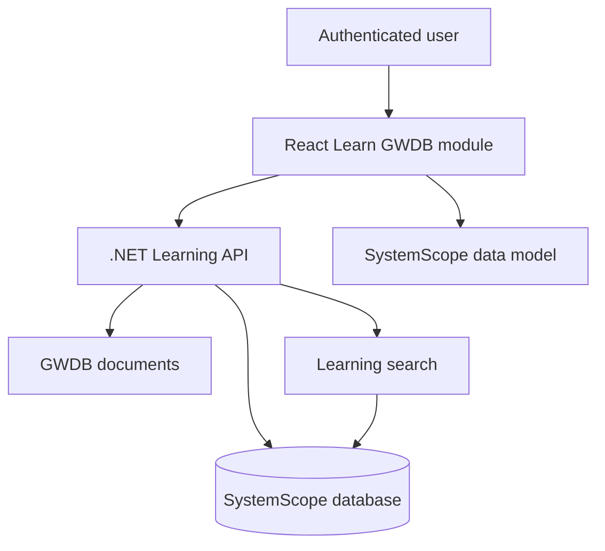

# Learn GWDB Feature - Implementation Guide

## 1. Purpose

The **Learn GWDB** feature provides an interactive learning and knowledge-transfer experience inside SystemScope. It helps new developers, solution architects, data analysts, support staff and project stakeholders understand the existing Groundwater Database without repeatedly searching the 170-page data dictionary.

The module must explain:

- Existing GWDB architecture and operating model
- Database fundamentals using real GWDB examples
- Registered Number (RN), Pipe, Date and Record
- Existing tables, attributes and relationships
- Groundwater terminology and business rules
- Documented, inferred and schema-verified information
- Oracle Forms, PL/SQL, integrations, reports and scheduled processes

This is a learning and knowledge-management feature. It does not replace the authoritative GWDB documentation or Oracle schema.

---

## 2. Objectives

1. Present GWDB concepts in short, understandable lessons.
2. Connect lessons to the existing system, data model and source documentation.
3. Provide a searchable table and field dictionary.
4. Allow users to explore table relationships interactively.
5. Record individual learning progress, bookmarks and notes.
6. Clearly distinguish confirmed facts from inferred relationships.
7. Support progressive improvement as Oracle schema and source-code access becomes available.

---

## 3. Recommended Technology Stack

| Layer | Technology | Purpose |
|---|---|---|
| Web application | React 19 and TypeScript | Learning dashboard, lesson reader and data-model explorer |
| UI components | Existing SystemScope design system | Consistent navigation, cards, buttons, tables and accessibility |
| API | ASP.NET Core .NET 10 | Learning, progress, notes, search and data-model services |
| Transactional database | Azure SQL | Courses, lessons, sources, progress, notes and metadata |
| Identity | Microsoft Entra ID | Authentication and user identity |
| Diagramming | React Flow | Interactive table and relationship explorer |
| Lesson content | Sanitised Markdown | Structured lesson authoring and rendering |
| PDF viewer | PDF.js | Open the source document at the relevant page |
| Search | Azure SQL full-text search initially | Search lessons, tables, fields and glossary terms |
| Observability | Application Insights | API, UI, search and error telemetry |

---

## 4. Logical Architecture



The learning module should reuse SystemScope's existing authentication, system catalogue, documentation and data-model records wherever possible.

---

## 5. Navigation

```text
GWDB
├── Overview
├── Architecture
├── Applications
├── Database
│   ├── Data Model
│   ├── Tables
│   ├── Relationships
│   └── Reference Codes
├── Integrations
├── Processes
├── Documentation
└── Learn GWDB
    ├── Learning Path
    ├── Lessons
    ├── Glossary
    ├── Knowledge Checks
    ├── Bookmarks
    └── My Notes
```

Suggested routes:

```text
/systems/{systemId}/learn
/systems/{systemId}/learn/lessons/{lessonId}
/systems/{systemId}/learn/glossary
/systems/{systemId}/learn/bookmarks
/systems/{systemId}/learn/notes
/systems/{systemId}/data-model
/systems/{systemId}/tables/{tableId}
```

---

## 6. Main Screens

### 6.1 Learning Dashboard

The dashboard should provide:

- Overall progress percentage
- Completed and remaining lesson counts
- Continue Learning card
- Ordered learning path
- Data-model preview
- Table Dictionary shortcut
- GWDB Glossary shortcut
- Bookmarks and notes shortcuts
- Evidence-status legend
- Search across learning content

### 6.2 Lesson Reader

Each lesson should contain:

1. Plain-English explanation
2. GWDB-specific example
3. Diagram or relationship visual
4. Relevant tables and fields
5. Existing business rules
6. Key points to remember
7. Optional knowledge check
8. Links to original source pages
9. Evidence-status labels
10. Bookmark and note actions

### 6.3 Interactive Data-Model Explorer

The explorer should support:

- Table nodes and relationship edges
- Zoom, pan, centre and fit-to-screen
- Search and domain filters
- Parent and child highlighting
- Relationship-field labels
- Documented, inferred and schema-verified colours
- Table detail drawer
- Source-document links
- Bookmarks and personal notes

### 6.4 Table Dictionary

For each table display:

- Logical table name
- Physical Oracle table name, when verified
- Description and business purpose
- Data domain
- Logical grain
- Documented attributes
- Candidate or confirmed primary key
- Parent and child relationships
- Source document and page numbers
- Evidence status
- Verification notes

### 6.5 Glossary

Initial glossary terms should include:

- Aquifer
- Artesian bore
- Bore
- Casing
- Conductivity
- Datum
- Drawdown
- Facility
- Lithology
- Measurement point
- Pipe
- Registered Number
- Standing water level
- Strata
- Yield

---

## 7. Initial Learning Path

| Order | Lesson | Indicative duration |
|---:|---|---:|
| 1 | What is GWDB? | 8 minutes |
| 2 | Database Fundamentals | 10 minutes |
| 3 | Registered Number (RN) | 10 minutes |
| 4 | Pipe, Date and Record | 12 minutes |
| 5 | Registration Table | 15 minutes |
| 6 | Construction and Casing | 15 minutes |
| 7 | Strata, Aquifers and Lithology | 15 minutes |
| 8 | Water Levels and Bore Logger Data | 15 minutes |
| 9 | Pumping Tests and Flow Readings | 15 minutes |
| 10 | Water Quality and Laboratory Analysis | 18 minutes |
| 11 | Drillers, Notices and Drill Logs | 12 minutes |
| 12 | Oracle Forms, PL/SQL and Integrations | 20 minutes |

---

## 8. Data Model

### 8.1 Learning Course

```sql
CREATE TABLE LearningCourse (
    CourseId UNIQUEIDENTIFIER NOT NULL PRIMARY KEY,
    SystemId UNIQUEIDENTIFIER NOT NULL,
    Title NVARCHAR(200) NOT NULL,
    Description NVARCHAR(1000) NULL,
    Status NVARCHAR(30) NOT NULL,
    DisplayOrder INT NOT NULL,
    CreatedAtUtc DATETIME2 NOT NULL,
    UpdatedAtUtc DATETIME2 NOT NULL
);
```

### 8.2 Learning Lesson

```sql
CREATE TABLE LearningLesson (
    LessonId UNIQUEIDENTIFIER NOT NULL PRIMARY KEY,
    CourseId UNIQUEIDENTIFIER NOT NULL,
    Title NVARCHAR(200) NOT NULL,
    Summary NVARCHAR(1000) NULL,
    ContentMarkdown NVARCHAR(MAX) NOT NULL,
    DurationMinutes INT NULL,
    DisplayOrder INT NOT NULL,
    Status NVARCHAR(30) NOT NULL,
    EvidenceStatus NVARCHAR(30) NULL,
    PublishedVersion INT NOT NULL,
    CreatedAtUtc DATETIME2 NOT NULL,
    UpdatedAtUtc DATETIME2 NOT NULL,
    CONSTRAINT FK_LearningLesson_Course
        FOREIGN KEY (CourseId) REFERENCES LearningCourse(CourseId)
);
```

### 8.3 Lesson Source

```sql
CREATE TABLE LessonSource (
    LessonSourceId UNIQUEIDENTIFIER NOT NULL PRIMARY KEY,
    LessonId UNIQUEIDENTIFIER NOT NULL,
    DocumentId UNIQUEIDENTIFIER NOT NULL,
    PageFrom INT NULL,
    PageTo INT NULL,
    SectionName NVARCHAR(300) NULL,
    EvidenceStatus NVARCHAR(30) NOT NULL,
    SourceNote NVARCHAR(1000) NULL,
    CONSTRAINT FK_LessonSource_Lesson
        FOREIGN KEY (LessonId) REFERENCES LearningLesson(LessonId)
);
```

### 8.4 User Lesson Progress

```sql
CREATE TABLE UserLessonProgress (
    UserId UNIQUEIDENTIFIER NOT NULL,
    LessonId UNIQUEIDENTIFIER NOT NULL,
    ProgressPercentage INT NOT NULL,
    Status NVARCHAR(30) NOT NULL,
    StartedAtUtc DATETIME2 NULL,
    LastAccessedAtUtc DATETIME2 NULL,
    CompletedAtUtc DATETIME2 NULL,
    LastPosition NVARCHAR(200) NULL,
    CONSTRAINT PK_UserLessonProgress PRIMARY KEY (UserId, LessonId),
    CONSTRAINT FK_UserLessonProgress_Lesson
        FOREIGN KEY (LessonId) REFERENCES LearningLesson(LessonId),
    CONSTRAINT CK_UserLessonProgress_Percentage
        CHECK (ProgressPercentage BETWEEN 0 AND 100)
);
```

### 8.5 Bookmark

```sql
CREATE TABLE LearningBookmark (
    BookmarkId UNIQUEIDENTIFIER NOT NULL PRIMARY KEY,
    UserId UNIQUEIDENTIFIER NOT NULL,
    LessonId UNIQUEIDENTIFIER NULL,
    EntityType NVARCHAR(50) NULL,
    EntityId NVARCHAR(200) NULL,
    Label NVARCHAR(300) NULL,
    CreatedAtUtc DATETIME2 NOT NULL
);
```

### 8.6 Personal Note

```sql
CREATE TABLE LearningNote (
    NoteId UNIQUEIDENTIFIER NOT NULL PRIMARY KEY,
    UserId UNIQUEIDENTIFIER NOT NULL,
    LessonId UNIQUEIDENTIFIER NULL,
    EntityType NVARCHAR(50) NULL,
    EntityId NVARCHAR(200) NULL,
    NoteText NVARCHAR(MAX) NOT NULL,
    CreatedAtUtc DATETIME2 NOT NULL,
    UpdatedAtUtc DATETIME2 NOT NULL
);
```

### 8.7 Glossary Term

```sql
CREATE TABLE LearningGlossaryTerm (
    GlossaryTermId UNIQUEIDENTIFIER NOT NULL PRIMARY KEY,
    SystemId UNIQUEIDENTIFIER NOT NULL,
    Term NVARCHAR(200) NOT NULL,
    ShortDefinition NVARCHAR(500) NOT NULL,
    DetailedDefinition NVARCHAR(MAX) NULL,
    EvidenceStatus NVARCHAR(30) NOT NULL,
    SourceDocumentId UNIQUEIDENTIFIER NULL,
    SourcePage INT NULL
);
```

### 8.8 Knowledge Check

```sql
CREATE TABLE LessonQuestion (
    QuestionId UNIQUEIDENTIFIER NOT NULL PRIMARY KEY,
    LessonId UNIQUEIDENTIFIER NOT NULL,
    QuestionText NVARCHAR(1000) NOT NULL,
    Explanation NVARCHAR(2000) NULL,
    DisplayOrder INT NOT NULL,
    CONSTRAINT FK_LessonQuestion_Lesson
        FOREIGN KEY (LessonId) REFERENCES LearningLesson(LessonId)
);

CREATE TABLE LessonQuestionOption (
    OptionId UNIQUEIDENTIFIER NOT NULL PRIMARY KEY,
    QuestionId UNIQUEIDENTIFIER NOT NULL,
    OptionText NVARCHAR(1000) NOT NULL,
    IsCorrect BIT NOT NULL,
    DisplayOrder INT NOT NULL,
    CONSTRAINT FK_LessonQuestionOption_Question
        FOREIGN KEY (QuestionId) REFERENCES LessonQuestion(QuestionId)
);
```

---

## 9. Evidence Status

Every lesson, statement, glossary term, table and relationship should support an evidence status.

| Status | Meaning | Suggested colour |
|---|---|---|
| Documented | Explicitly stated in an approved source document | Green |
| Inferred | Derived from table structure, repeated fields or technical analysis | Amber |
| Schema verified | Confirmed from Oracle DDL, metadata or source code | Blue |

The system must never display an inferred relationship as schema verified without evidence.

---

## 10. React Component Structure

```text
LearnGwdbPage
├── LearningHeader
├── LearningProgressSummary
├── ContinueLearningCard
├── LearningPath
│   └── LessonCard
├── DataModelPreview
├── QuickAccessPanel
└── EvidenceLegend

LessonReaderPage
├── LessonNavigation
├── LessonHeader
├── MarkdownLessonContent
├── SourceReferencePanel
├── KnowledgeCheck
├── BookmarkButton
├── PersonalNotesPanel
└── LessonProgressControls

DataModelExplorerPage
├── ModelToolbar
├── DomainFilter
├── ReactFlowCanvas
├── TableNode
├── RelationshipEdge
├── TableDetailsDrawer
└── EvidenceLegend
```

---

## 11. API Design

### 11.1 Dashboard

```http
GET /api/systems/{systemId}/learning-dashboard
```

Returns:

- Course information
- Overall user progress
- Current lesson
- Ordered lesson cards
- Quick-access counts
- Data-model preview

### 11.2 Lessons

```http
GET /api/learning/lessons/{lessonId}
GET /api/learning/courses/{courseId}/lessons
PUT /api/learning/lessons/{lessonId}/progress
POST /api/learning/lessons/{lessonId}/complete
```

### 11.3 Bookmarks and Notes

```http
GET    /api/learning/bookmarks
POST   /api/learning/bookmarks
DELETE /api/learning/bookmarks/{bookmarkId}

GET    /api/learning/notes
POST   /api/learning/notes
PUT    /api/learning/notes/{noteId}
DELETE /api/learning/notes/{noteId}
```

### 11.4 Search

```http
GET /api/systems/{systemId}/learning-search?q={query}
```

Search results should include:

- Lessons
- Lesson sections
- Tables
- Fields
- Relationships
- Glossary terms
- Documentation references

### 11.5 Data Model

```http
GET /api/systems/{systemId}/data-model
GET /api/systems/{systemId}/tables/{tableId}
GET /api/systems/{systemId}/relationships/{relationshipId}
```

---

## 12. Example Dashboard Response

```json
{
  "course": {
    "courseId": "b47f84f1-4c21-4e3f-8380-a3c0b5426d77",
    "title": "Learn GWDB",
    "lessonCount": 12
  },
  "progress": {
    "completedLessons": 3,
    "totalLessons": 12,
    "percentage": 25
  },
  "continueLesson": {
    "lessonId": "da4aa4d2-0174-4b9a-a8e3-255a8f3a92cc",
    "title": "Registered Number (RN)",
    "durationMinutes": 10,
    "status": "InProgress"
  },
  "lessons": [],
  "quickAccess": {
    "bookmarks": 4,
    "notes": 7
  }
}
```

---

## 13. Progress Rules

- A lesson becomes `InProgress` when it is first opened.
- Progress can be calculated from completed lesson sections or explicitly saved positions.
- A lesson becomes `Completed` after the user reaches the end and selects **Mark complete**.
- Knowledge checks are optional unless the course is later configured as formal training.
- Reopening a completed lesson must not remove its completed status.
- Course progress equals completed published lessons divided by total published lessons.
- Progress is stored per user and per lesson.

---

## 14. Content Authoring

Lesson content should be stored as sanitised Markdown.

Supported elements:

- Headings
- Paragraphs
- Bulleted and numbered lists
- Tables
- Code examples
- Blockquotes and important notes
- Mermaid diagrams, if securely supported
- Links to tables, fields and documents

Required lesson metadata:

- Title
- Summary
- Learning objectives
- Duration
- Display order
- Evidence status
- Source references
- Published version
- Review status

Only authorised content editors should publish or replace lessons.

---

## 15. Source Document Integration

Each lesson may reference one or more sections of the GWDB Data Dictionary.

When a user selects a source reference:

1. Open the document viewer.
2. Navigate directly to the referenced page.
3. Display the document name and version.
4. Show the associated evidence status.
5. Preserve the user's position in the lesson.

The source document remains authoritative. The lesson is an accessible explanation of that source.

---

## 16. Security and Permissions

Suggested application permissions:

| Permission | Purpose |
|---|---|
| Learning.Read | View published courses and lessons |
| Learning.Progress | Update personal progress |
| Learning.Notes | Manage personal notes and bookmarks |
| Learning.Author | Create and edit draft lessons |
| Learning.Publish | Publish lesson versions |
| DataModel.Read | View the table and relationship explorer |
| DataModel.Verify | Mark relationships or fields as schema verified |

Security requirements:

- Use the authenticated Entra ID user as the progress owner.
- Users can only read and modify their own notes.
- Lesson publishing must be restricted and audited.
- Evidence-status changes must be audited.
- Confidential GWDB content must not be copied into unrestricted lessons.
- Markdown and links must be sanitised before rendering.
- APIs must enforce permissions; UI visibility alone is insufficient.

---

## 17. Accessibility

The feature should meet WCAG 2.2 AA requirements.

- Complete keyboard navigation
- Visible focus indicators
- Semantic headings and landmarks
- Sufficient colour contrast
- Evidence status communicated using text as well as colour
- Accessible relationship summaries for users who cannot use the visual graph
- Alternative text for diagrams
- Screen-reader labels for progress indicators
- Captions or transcripts for future videos

---

## 18. Search Design

The first version can use Azure SQL full-text search across:

- Lesson title
- Lesson summary
- Markdown text
- Table name
- Field name
- Glossary term
- Relationship description

Search results should be grouped by result type and ranked by relevance.

Example filters:

- Lessons
- Tables
- Fields
- Glossary
- Documentation
- Documented
- Inferred
- Schema verified

---

## 19. Non-Functional Requirements

| Requirement | Initial target |
|---|---|
| Dashboard response | P95 under 2 seconds |
| Search response | P95 under 2 seconds for normal queries |
| Lesson availability | Same availability target as SystemScope |
| Browser support | Department-supported evergreen browsers |
| Accessibility | WCAG 2.2 AA |
| Audit | Lesson publishing and evidence changes recorded |
| Data isolation | Personal notes accessible only to their owner |
| Content safety | Markdown sanitised and external links controlled |
| Observability | API errors, search latency and content failures monitored |

---

## 20. Delivery Phases

### Phase 1 - Learning Foundation

- Add Learn GWDB navigation
- Create learning database tables
- Build dashboard
- Build Markdown lesson reader
- Add the first 12 curated lessons
- Implement progress tracking

### Phase 2 - Personal Learning Tools

- Add bookmarks
- Add personal notes
- Add glossary
- Add knowledge checks
- Add learning search

### Phase 3 - Data-Model Explorer

- Connect to SystemScope table metadata
- Build React Flow explorer
- Add relationship details
- Add evidence-status colours and filters
- Link tables and relationships to lessons

### Phase 4 - Source Traceability

- Connect lessons to document pages
- Add embedded PDF viewer
- Add source-version information
- Add content-review and publishing workflow

### Phase 5 - Oracle Verification

- Import Oracle schema metadata
- Add physical table and column names
- Confirm primary and foreign keys
- Add schema-verified labels
- Link Oracle Forms and PL/SQL findings

---

## 21. MVP Acceptance Criteria

The first release is acceptable when:

- Users can open Learn GWDB from SystemScope navigation.
- The dashboard displays accurate individual progress.
- Twelve ordered lessons are available.
- Users can continue their most recently accessed lesson.
- Lesson content renders safely from Markdown.
- Users can mark lessons complete.
- Progress persists across sessions.
- Source-document references show document name and page.
- Evidence statuses are visible and explained.
- Users can search lessons and glossary terms.
- The application meets accessibility and permission requirements.

---

## 22. Implementation Recommendation

Start with manually curated and reviewed lessons. Do not automatically publish AI-generated explanations from the GWDB data dictionary.

AI may assist authors by creating drafts, summaries and suggested questions, but a knowledgeable reviewer must verify:

- Technical accuracy
- Groundwater terminology
- Business rules
- Source references
- Evidence status
- Confidentiality and publication suitability

The initial priority should be a reliable learning dashboard, lesson reader, progress tracking and source traceability. The interactive data-model explorer should follow once the existing SystemScope metadata model is ready.

