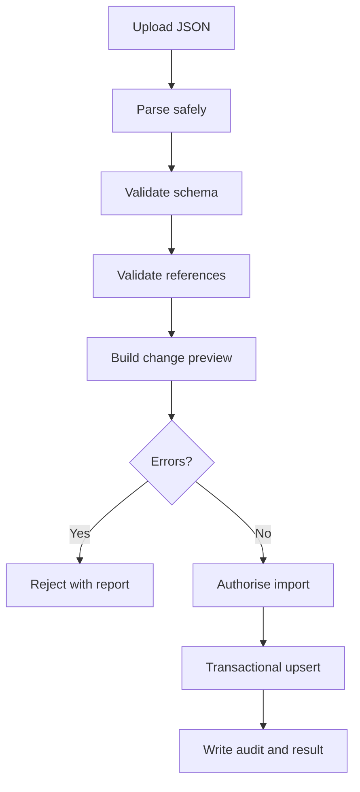

# Learn GWDB JSON Import Specification

## Purpose

The Learn GWDB feature must support importing a versioned JSON package to populate courses, lessons, source references, questions, glossary terms and data-model metadata.

The accompanying `Learn_GWDB_Import_Package.json` is an initial seed package containing:

- One GWDB learning course
- Twelve lessons
- Lesson content in Markdown
- Source-document page references
- Knowledge-check examples
- GWDB glossary terms
- Initial table and relationship metadata
- Evidence-status definitions

## Import User Journey

1. An authorised user opens **Learn GWDB > Administration > Import**.
2. The user selects or drops a JSON file.
3. The system validates the package without writing data.
4. The system displays an import preview.
5. The user reviews creates, updates, unchanged items, warnings and errors.
6. The user selects **Import as draft**.
7. The API imports the package transactionally.
8. The system displays a detailed result and audit reference.
9. An authorised publisher reviews and publishes lessons separately.

## Import Screen

The screen should include:

- File selector and drag-and-drop area
- Maximum size and accepted-format guidance
- Package version and system information
- Validate button
- Import preview grid
- Create/update/unchanged counts
- Error and warning list with JSON paths
- Import as draft button
- Downloadable result report
- Import history

## API Endpoints

```http
POST /api/systems/{systemId}/learning-imports/validate
Content-Type: multipart/form-data
```

Validates the package and creates no records.

```http
POST /api/systems/{systemId}/learning-imports
Content-Type: multipart/form-data
Idempotency-Key: {unique-import-key}
```

Imports a successfully validated package.

```http
GET /api/systems/{systemId}/learning-imports/{importId}
GET /api/systems/{systemId}/learning-imports/{importId}/errors
GET /api/systems/{systemId}/learning-imports
```

## Import Processing Flow



## Stable Keys

Imports must use stable business keys instead of generated database IDs:

| Entity | Stable key |
|---|---|
| System | `system.systemKey` |
| Course | `course.courseKey` |
| Lesson | `lessons[].lessonKey` |
| Document | `documents[].documentKey` |
| Question | `questions[].questionKey` |
| Glossary term | `glossary[].termKey` |
| Table | `dataModel.tables[].tableKey` |
| Relationship | `dataModel.relationships[].relationshipKey` |

The importer translates these stable keys into internal database identifiers.

## Upsert Behaviour

- A missing stable key creates a new item.
- A matching stable key updates the existing imported item.
- An identical item is reported as unchanged.
- Items missing from a later package are not automatically deleted.
- Deletion or retirement requires an explicit import action in a future schema version.
- User progress, bookmarks and personal notes are never imported or overwritten by course packages.
- Imported lessons remain draft unless a separately authorised publishing operation occurs.

## Validation Rules

### Package Validation

- JSON must be syntactically valid UTF-8.
- `schemaVersion` must be supported.
- `packageType` must equal `system-learning-course`.
- `packageId`, `system.systemKey` and `course.courseKey` are required.
- File size must be bounded, initially 10 MB.
- Unknown executable content and external file references must be rejected.

### Lesson Validation

- Lesson keys must be unique within the package.
- Display order must be unique within the course.
- Title, summary and Markdown content are required.
- Duration must be zero or greater.
- Evidence status must exist in `evidenceStatuses`.
- Every source `documentKey` must resolve.
- Markdown must pass sanitisation rules.
- Published content in an import package must still be imported as draft unless publishing is explicitly authorised.

### Question Validation

- Question keys must be unique.
- Each question must contain at least two options.
- Exactly one option should be correct for the initial single-answer question type.
- Option display order must be unique within a question.

### Data-Model Validation

- Table keys must be unique.
- Relationship endpoints must reference existing or already stored tables.
- Relationship fields cannot be empty.
- `SCHEMA_VERIFIED` cannot be applied unless the importing user has `DataModel.Verify` and the package includes an accepted verification reference.
- Imports cannot downgrade `SCHEMA_VERIFIED` to `INFERRED` or `DOCUMENTED` by default.

## Import Preview Response

```json
{
  "validationId": "d861c4a7-f031-4ad1-90f0-86e5f783569e",
  "isValid": true,
  "packageId": "learn-gwdb-v1",
  "summary": {
    "create": 39,
    "update": 0,
    "unchanged": 0,
    "warnings": 3,
    "errors": 0
  },
  "items": [
    {
      "entityType": "Lesson",
      "stableKey": "GWDB-L01",
      "operation": "Create",
      "message": "Lesson will be imported as draft."
    }
  ]
}
```

## Error Response

```json
{
  "isValid": false,
  "errors": [
    {
      "code": "SOURCE_DOCUMENT_NOT_FOUND",
      "jsonPath": "$.lessons[0].sources[0].documentKey",
      "message": "Document key GWDB-DATA-DICTIONARY-2024 was not found."
    }
  ]
}
```

Errors must identify the JSON path and provide a user-understandable correction.

## Transaction and Idempotency

- Validation performs no persistent content changes.
- Import runs inside a database transaction.
- With `all-or-nothing`, any error rolls back the entire package.
- The client supplies an `Idempotency-Key`.
- The server stores the idempotency key, file hash and result.
- Repeating the same successful request returns the earlier result without duplicating data.
- A package with the same `packageId` but different content hash is treated as a new version and requires preview.

## Suggested Import Tables

```sql
CREATE TABLE LearningImport (
    ImportId UNIQUEIDENTIFIER NOT NULL PRIMARY KEY,
    SystemId UNIQUEIDENTIFIER NOT NULL,
    PackageId NVARCHAR(200) NOT NULL,
    SchemaVersion NVARCHAR(20) NOT NULL,
    FileName NVARCHAR(260) NOT NULL,
    FileHash NVARCHAR(128) NOT NULL,
    IdempotencyKey NVARCHAR(200) NULL,
    Status NVARCHAR(30) NOT NULL,
    RequestedBy UNIQUEIDENTIFIER NOT NULL,
    RequestedAtUtc DATETIME2 NOT NULL,
    CompletedAtUtc DATETIME2 NULL,
    CreatedCount INT NOT NULL DEFAULT 0,
    UpdatedCount INT NOT NULL DEFAULT 0,
    UnchangedCount INT NOT NULL DEFAULT 0,
    WarningCount INT NOT NULL DEFAULT 0,
    ErrorCount INT NOT NULL DEFAULT 0
);

CREATE TABLE LearningImportItem (
    ImportItemId UNIQUEIDENTIFIER NOT NULL PRIMARY KEY,
    ImportId UNIQUEIDENTIFIER NOT NULL,
    EntityType NVARCHAR(50) NOT NULL,
    StableKey NVARCHAR(200) NULL,
    Operation NVARCHAR(30) NOT NULL,
    Status NVARCHAR(30) NOT NULL,
    JsonPath NVARCHAR(1000) NULL,
    ErrorCode NVARCHAR(100) NULL,
    Message NVARCHAR(2000) NULL,
    CONSTRAINT FK_LearningImportItem_Import
        FOREIGN KEY (ImportId) REFERENCES LearningImport(ImportId)
);
```

## Security

Suggested permissions:

- `Learning.Import.Validate`
- `Learning.Import.Execute`
- `Learning.Publish`
- `DataModel.Verify`

Controls:

- Authenticate with Entra ID.
- Authorise validation and execution separately.
- Apply file-size and request-rate limits.
- Never execute content contained in the JSON.
- Sanitise Markdown before storage or rendering.
- Audit importer, timestamp, package ID, file hash and changes.
- Do not allow an import to write user progress, notes or bookmarks.
- Do not automatically publish imported lessons.

## Recommended Implementation Sequence

1. Define C# import DTOs matching schema version 1.0.
2. Add JSON Schema validation.
3. Implement semantic and reference validation.
4. Build the preview/change-set service.
5. Add import audit tables.
6. Implement transactional stable-key upserts.
7. Add idempotency and file-hash checks.
8. Build the React upload and preview screen.
9. Add downloadable error reports.
10. Test create, update, unchanged, duplicate, invalid-reference and rollback scenarios.

